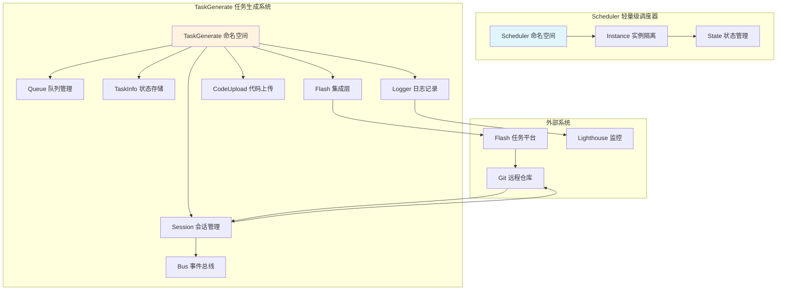
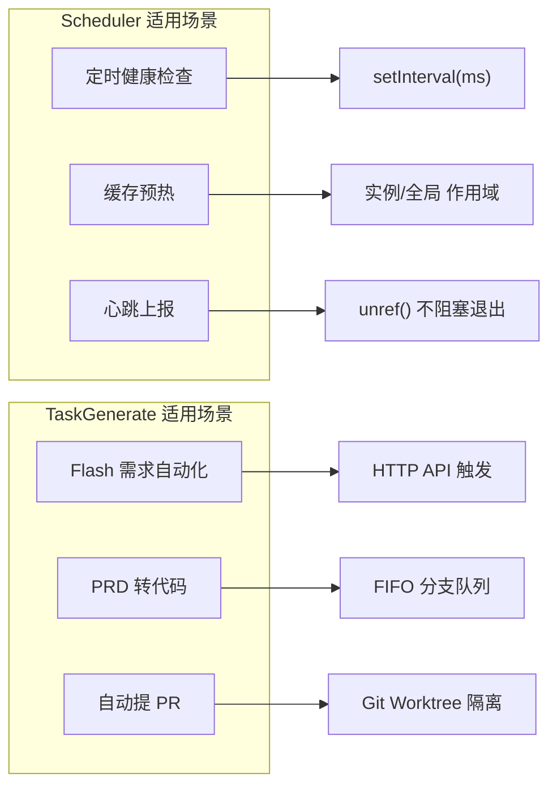
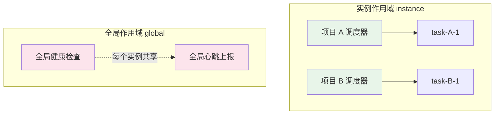
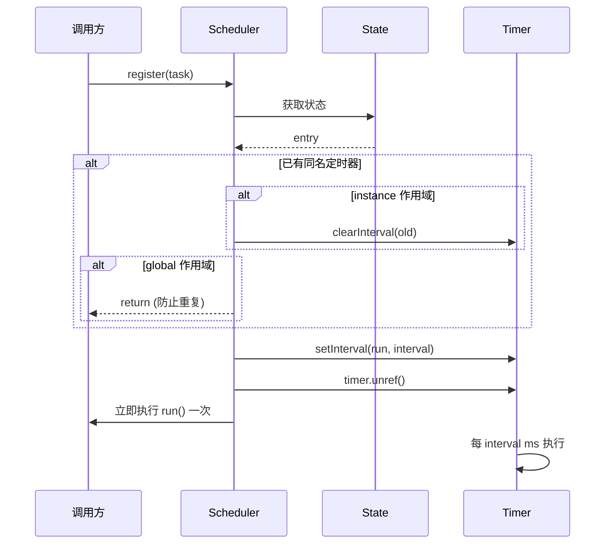
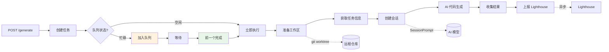
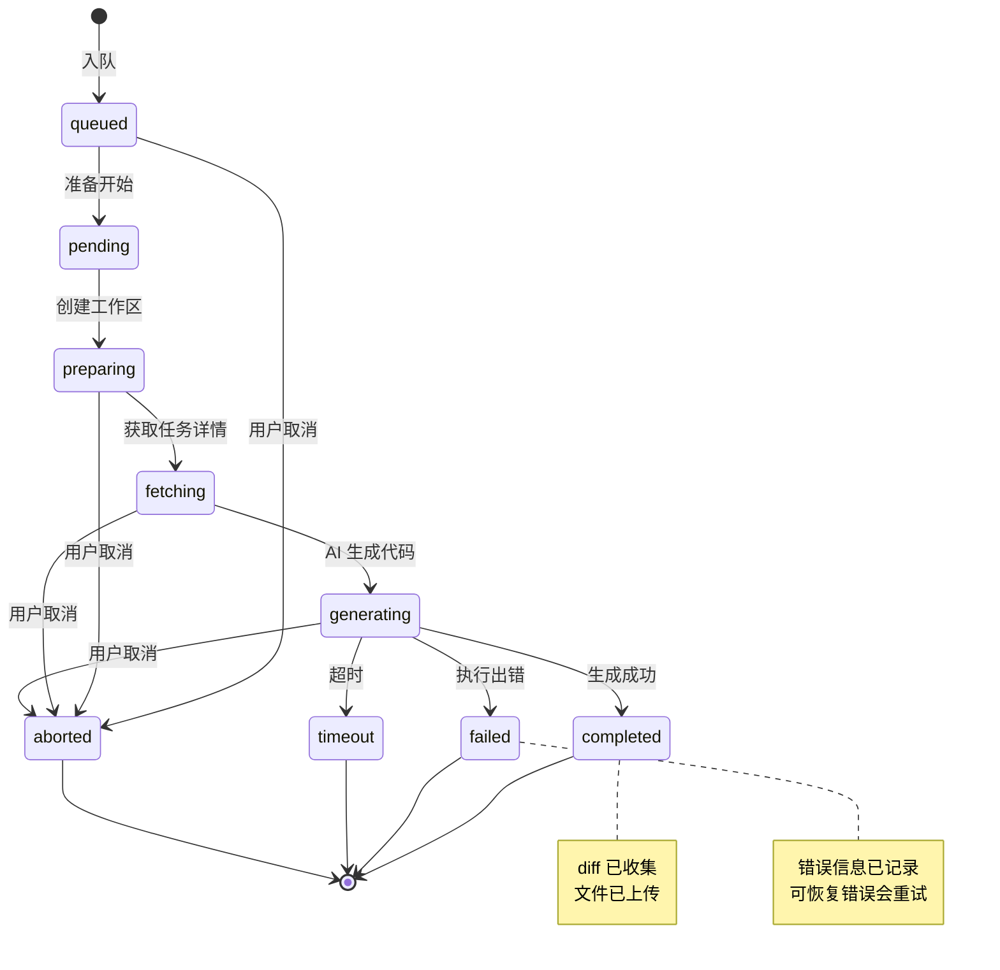
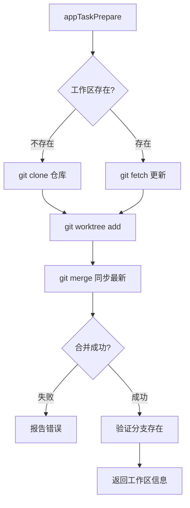
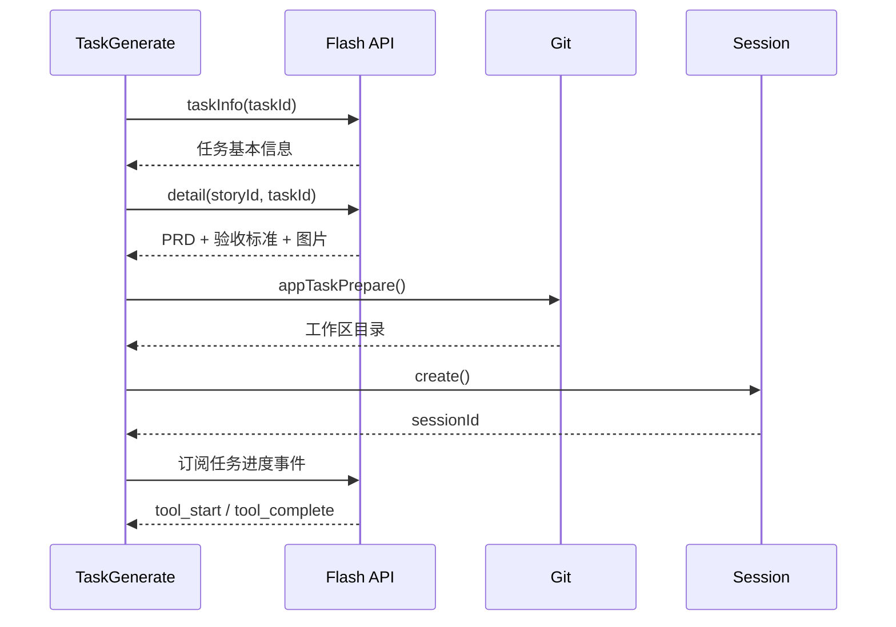
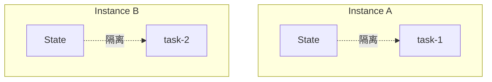
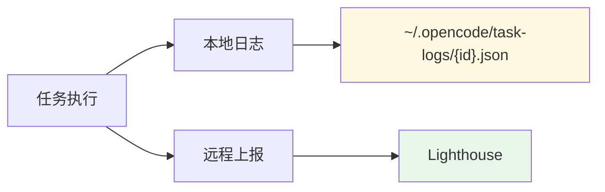

# 定时任务实现原理详解

> 基于 OpenCode 源码分析，版本截止 2026-03-28

## 目录

1. [概述](#概述)
2. [整体架构总览](#整体架构总览)
3. [轻量级调度器 Scheduler](#轻量级调度器-scheduler)
4. [任务生成系统 TaskGenerate](#任务生成系统-taskgenerate)
5. [任务状态机](#任务状态机)
6. [队列管理机制](#队列管理机制)
7. [Flash 集成](#flash-集成)
8. [关键设计模式](#关键设计模式)
9. [关键源码文件索引](#关键源码文件索引)

---

## 概述

OpenCode 的定时任务系统包含**两套独立的实现**：

| 系统 | 文件位置 | 用途 | 调度方式 |
|------|---------|------|----------|
| **Scheduler** | `packages/opencode/src/scheduler/` | 轻量级间隔调度 | `setInterval` 间隔执行 |
| **TaskGenerate** | `packages/opencode/src/task/generate.ts` | Flash 任务自动化代码生成 | HTTP API 触发 + FIFO 队列 |

### 1. 轻量级调度器 (Scheduler)

用于周期性后台任务，简单的 `setInterval` 实现，支持**实例级**和**全局级**两种作用域隔离。

### 2. 任务生成系统 (TaskGenerate)

用于对接 Flash 任务管理系统，自动执行 AI 代码生成。包含完整的任务队列、状态机、进度追踪和错误处理机制。

---

## 整体架构总览



### 两大系统的对比



---

## 轻量级调度器 Scheduler

### 核心类型定义

**文件：** `packages/opencode/src/scheduler/index.ts`

```typescript
// 任务定义
export type Task = {
  id: string              // 唯一标识
  interval: number       // 执行间隔（毫秒）
  run: () => Promise<void>  // 执行函数
  scope?: "instance" | "global"  // 作用域
}

// 内部数据结构
type Timer = ReturnType<typeof setInterval>
type Entry = {
  tasks: Map<string, Task>    // 任务映射
  timers: Map<string, Timer>  // 定时器映射
}
```

### 作用域机制



**实例作用域**：每个项目实例独立的调度器，任务只在该实例内生效。
**全局作用域**：跨所有实例共享，通常用于监控类任务。

### 核心注册流程



### 关键实现细节

**1. 防止重复注册**

```typescript
// 全局作用域：已注册则跳过
if (task.scope === "global" && entry.timers.has(task.id)) {
  return
}

// 实例作用域：先清除旧的再注册
if (entry.timers.has(task.id)) {
  clearInterval(entry.timers.get(task.id)!)
}
```

**2. 自动清理 (dispose)**

```typescript
const state = Instance.state(
  () => create(),
  async (entry) => {
    // 清除所有定时器
    for (const timer of entry.timers.values()) {
      clearInterval(timer)
    }
    // 清理任务映射
    entry.tasks.clear()
  }
)
```

**3. 进程退出不阻塞 (`unref`)**

```typescript
const timer = setInterval(task.run, task.interval)
timer.unref() // 允许进程在没有其他工作时退出
```

### 使用示例

```typescript
import { Scheduler } from "./scheduler"

// 注册实例级任务
Scheduler.register({
  id: "health-check",
  interval: 30 * 1000,  // 30秒
  scope: "instance",
  run: async () => {
    console.log("健康检查...")
  }
})

// 注册全局任务
Scheduler.register({
  id: "global-telemetry",
  interval: 60 * 1000,
  scope: "global",
  run: async () => {
    await reportMetrics()
  }
})
```

---

## 任务生成系统 TaskGenerate

### 核心数据流



### 任务状态机



### 核心类型定义

**文件：** `packages/opencode/src/task/generate.ts`

```typescript
// 任务状态枚举
const TaskStatus = z.enum([
  "queued",      // 排队中
  "pending",     // 等待执行
  "preparing",   // 准备中（创建工作区）
  "fetching",    // 获取任务信息
  "generating",  // AI 代码生成中
  "completed",    // 完成
  "failed",      // 失败
  "aborted",     // 中止
  "timeout"      // 超时
])

// 任务信息结构
const TaskInfo = z.object({
  id: z.string(),
  taskId: z.number(),           // Flash 任务 ID
  appId: z.string(),
  sessionId: z.string().optional(),
  status: TaskStatus,
  workspace: z.object({
    directory: z.string(),      // 工作区目录
    branch: z.string(),         // 分支名
    repoDir: z.string(),        // 仓库路径
  }).optional(),
  progress: z.object({
    startedAt: z.number(),
    updatedAt: z.number(),
    step: z.string().optional(),
    message: z.string().optional(),
    currentTool: z.string().optional(),
    stats: z.object({
      toolsExecuted: z.number().optional(),
      filesModified: z.number().optional(),
      filesRead: z.number().optional(),
    }).optional(),
  }).optional(),
  result: z.object({
    duration: z.number(),
    startedAt: z.number(),
    completedAt: z.number(),
    summary: z.string().optional(),
    filesChanged: z.array(z.object({
      path: z.string(),
      changeType: z.string()
    })),
    diffs: z.record(z.string(), z.string()),
  }).optional(),
  error: z.object({
    code: z.string(),
    message: z.string(),
    detail: z.string().optional(),
    failedAt: z.string().optional(),
    recoverable: z.boolean().optional(),
  }).optional(),
  queue: z.object({
    position: z.number(),
    queuedAt: z.number(),
  }).optional(),
  createdAt: z.number(),
})
```

### 队列管理机制

```mermaid
graph TB
    subgraph "Queue 队列管理 (per appId + branch)"
        Q1[QueueItem<br/>id: task-1]
        Q2[QueueItem<br/>id: task-2]
        Q3[QueueItem<br/>id: task-3]

        subgraph "BranchQueue"
            R[running: task-1]
            P[pending: [task-2, task-3]]
        end
    end

    style R fill:#c8e6c9
    style P fill:#fff3e0
```

**关键特性**：
- **FIFO 队列**：先入先出，保证任务顺序
- **分支隔离**：每个 (appId, branch) 组合有独立队列
- **单并发**：每个分支同时只运行一个任务

```typescript
type QueueItem = { id: string; input: GenerateInput }
type BranchQueue = {
  running: string | null      // 当前运行的任务
  pending: QueueItem[]         // 等待队列
}

// 队列操作
queues.get(key)!.pending.push({ id, input })  // 入队
processNextInQueue(key)  // 执行下一个
```

---

## Flash 集成

### 工作区准备流程



### Flash API 调用链



---

## 关键设计模式

### 1. 实例隔离模式 (Instance State)



每个项目实例有独立的 State 存储，调度器和任务互不影响。

### 2. 事件驱动进度追踪


通过 `Bus.subscribe` 监听工具执行事件，实时更新任务进度。

### 3. Git Worktree 隔离

```mermaid
graph TB
    subgraph "主仓库"
        M[(main)]
        M1[(feature-1)]
        M2[(feature-2)]
    end

    W1[Worktree 1<br/>task-1]
    W2[Worktree 2<br/>task-2]

    M --> W1
    M --> W2

    W1 -.->|独立目录| D1[/tmp/opencode-task-1]
    W2 -.->|独立目录| D2[/tmp/opencode-task-2]

    style D1 fill:#e3f2fd
    style D2 fill:#e3f2fd
```

每个任务在独立的 git worktree 中执行，避免分支冲突。

### 4. 双日志策略



**本地日志**：完整任务记录，用于调试和问题排查。
**远程上报**：关键指标上报，用于监控和告警。

### 5. 自动清理 (Disposable State)

```typescript
// State.create 第二个参数是清理函数
const state = Instance.state(
  () => create(),
  async (entry) => {
    // 实例销毁时自动清理
    for (const timer of entry.timers.values()) {
      clearInterval(timer)
    }
    entry.tasks.clear()
    entry.timers.clear()
  }
)
```

---

## 关键源码文件索引

| 组件 | 文件路径 | 职责 |
|------|---------|------|
| **Scheduler 核心** | `packages/opencode/src/scheduler/index.ts` | 轻量级间隔调度器 |
| **TaskGenerate 核心** | `packages/opencode/src/task/generate.ts` | 任务生成主逻辑 |
| **任务日志** | `packages/opencode/src/task/logger.ts` | 本地 + Lighthouse 日志 |
| **代码上传** | `packages/opencode/src/task/code-upload.ts` | 生成结果上传 |
| **Flash 集成** | `packages/opencode/src/flash/story-task.ts` | Flash API 调用 |
| **HTTP 路由** | `packages/opencode/src/server/routes/task-generate.ts` | API 端点定义 |
| **实例管理** | `packages/opencode/src/project/instance.ts` | 实例隔离 |
| **状态管理** | `packages/opencode/src/project/state.ts` | 可销毁状态 |
| **事件总线** | `packages/opencode/src/bus/index.ts` | 发布订阅 |
| **会话管理** | `packages/opencode/src/session/index.ts` | AI 会话 |
| **调度器测试** | `packages/opencode/test/scheduler.test.ts` | 单元测试 |
| **生成任务测试** | `packages/opencode/test/server/task-generate.test.ts` | API 测试 |

---

## 总结

| 特性 | Scheduler | TaskGenerate |
|------|-----------|-------------|
| **调度方式** | 间隔执行 (`setInterval`) | HTTP API 触发 |
| **作用域** | instance / global | 全局队列 |
| **触发方式** | 启动时注册 | 外部 API 调用 |
| **并发控制** | 无限制（各实例独立） | FIFO 队列（按分支） |
| **错误恢复** | 无 | 可恢复错误重试 |
| **进度追踪** | 无 | 实时 Bus 事件 |
| **适用场景** | 健康检查、心跳 | 自动化代码生成 |

---

> 文档生成时间: 2026-03-28
