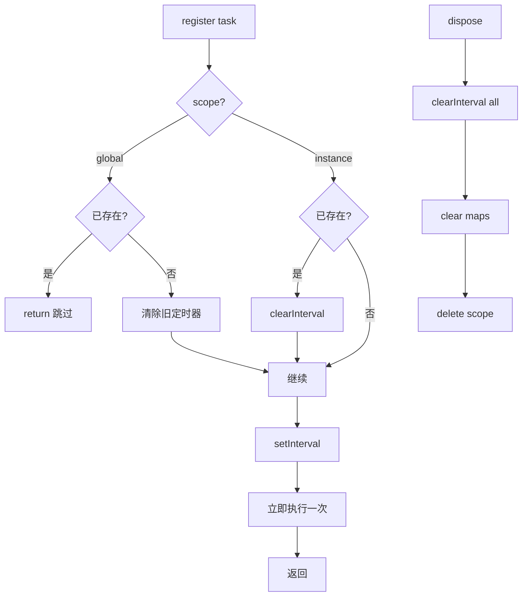
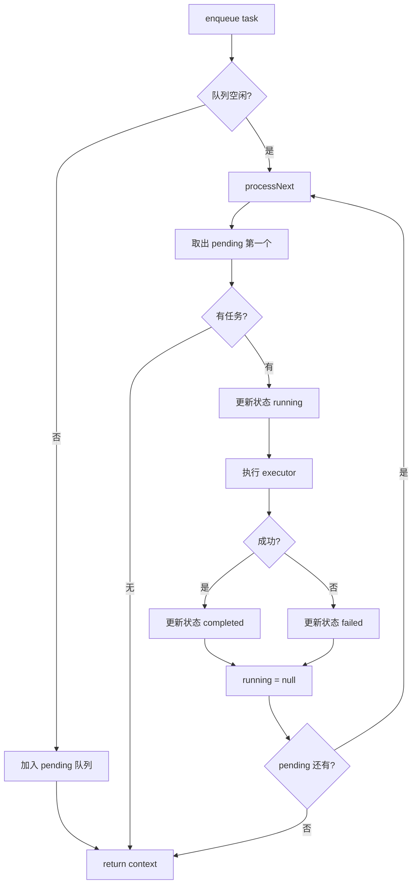
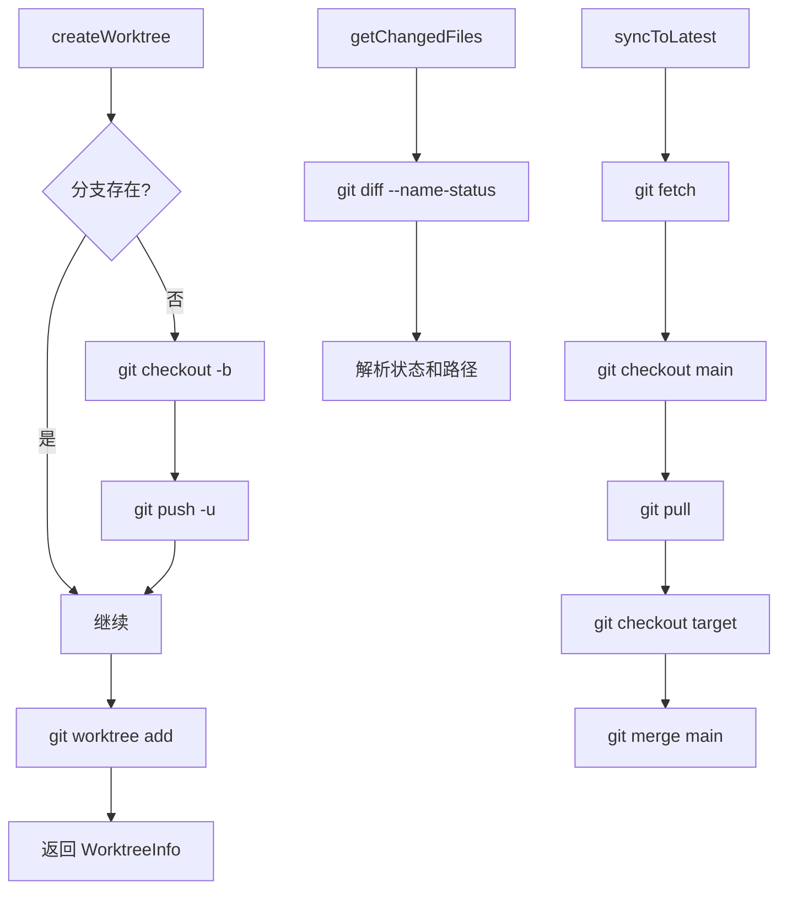
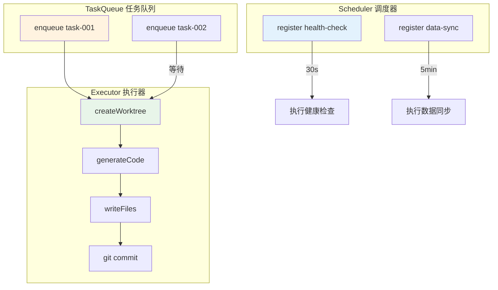

# 定时任务最小化实现

> 基于 OpenCode Scheduler 架构的最小化实现，包含调度器和任务队列两个核心系统

## 目录

1. [概述](#概述)
2. [最小化调度器](#最小化调度器)
3. [最小化任务队列](#最小化任务队列)
4. [最小化 Worktree 管理](#最小化-worktree-管理)
5. [完整示例：整合系统](#完整示例整合系统)
6. [运行与测试](#运行与测试)

---

## 概述

本篇是定时任务实现原理的实战篇，提供两套最小化实现：

| 系统 | 核心功能 | 代码量 |
|------|---------|--------|
| **Scheduler** | 间隔执行 + 作用域隔离 | ~60 行 |
| **TaskQueue** | FIFO 队列 + 状态机 + 进度追踪 | ~120 行 |

### 前置知识

- TypeScript 基础
- Node.js `setInterval` / `clearInterval`
- Promise 和 async/await

---

## 最小化调度器

### 1. 类型定义

```typescript
// task.ts
export type Task = {
  id: string
  interval: number        // 间隔（毫秒）
  run: () => Promise<void>
  scope: "instance" | "global"  // 作用域
}

// 内部数据结构
type Timer = ReturnType<typeof setInterval>
type Entry = {
  tasks: Map<string, Task>
  timers: Map<string, Timer>
}
```

### 2. 调度器核心实现

```typescript
// scheduler.ts
import { Task, type Entry } from "./task"

type Timer = ReturnType<typeof setInterval>

// 全局存储（模拟 Instance.state）
const records = new Map<string, Entry>()

function create(): Entry {
  return {
    tasks: new Map(),
    timers: new Map(),
  }
}

// 获取或创建指定 key 的状态
function getOrCreate(key: string): Entry {
  if (!records.has(key)) {
    records.set(key, create())
  }
  return records.get(key)!
}

// 注册定时任务
function register(task: Task, scopeKey: string = "default"): void {
  const entry = getOrCreate(scopeKey)

  // 全局作用域：防止重复注册
  if (task.scope === "global" && entry.timers.has(task.id)) {
    console.log(`[Scheduler] 全局任务 ${task.id} 已存在，跳过`)
    return
  }

  // 实例作用域：清除旧的定时器
  if (entry.timers.has(task.id)) {
    console.log(`[Scheduler] 清除旧定时器: ${task.id}`)
    clearInterval(entry.timers.get(task.id)!)
  }

  // 存储任务
  entry.tasks.set(task.id, task)

  // 设置定时器
  const timer = setInterval(async () => {
    try {
      await task.run()
    } catch (error) {
      console.error(`[Scheduler] 任务 ${task.id} 执行失败:`, error)
    }
  }, task.interval)

  // unref() 让进程可以在没有其他工作时退出
  timer.unref()

  entry.timers.set(task.id, timer)
  console.log(`[Scheduler] 注册任务 ${task.id}, 间隔 ${task.interval}ms`)

  // 立即执行一次
  task.run().catch((error) =>
    console.error(`[Scheduler] 初始执行失败:`, error)
  )
}

// 清理指定作用域的所有定时器
function dispose(scopeKey: string): void {
  const entry = records.get(scopeKey)
  if (!entry) return

  for (const timer of entry.timers.values()) {
    clearInterval(timer)
  }
  entry.tasks.clear()
  entry.timers.clear()
  records.delete(scopeKey)
  console.log(`[Scheduler] 已清理作用域: ${scopeKey}`)
}

// 清除指定任务
function unregister(taskId: string, scopeKey: string = "default"): void {
  const entry = records.get(scopeKey)
  if (!entry) return

  if (entry.timers.has(taskId)) {
    clearInterval(entry.timers.get(taskId)!)
    entry.timers.delete(taskId)
  }
  entry.tasks.delete(taskId)
  console.log(`[Scheduler] 已注销任务: ${taskId}`)
}

export const Scheduler = { register, unregister, dispose }
```

### 3. 流程图



---

## 最小化任务队列

### 1. 类型定义

```typescript
// queue.ts

// 任务状态
export type TaskStatus =
  | "queued"      // 排队中
  | "pending"     // 等待执行
  | "running"     // 执行中
  | "completed"   // 完成
  | "failed"      // 失败
  | "aborted"     // 中止

// 任务输入
export type TaskInput = {
  id: string
  data: unknown
  onProgress?: (step: string, message: string) => void
}

// 任务上下文
export type TaskContext = {
  id: string
  status: TaskStatus
  input: TaskInput
  startedAt?: number
  completedAt?: number
  result?: unknown
  error?: string
  progress: { step: string; message: string }[]
}

// 执行器类型
export type Executor = (
  ctx: TaskContext,
  input: TaskInput
) => Promise<void>
```

### 2. 队列核心实现

```typescript
// task-queue.ts
import type { TaskInput, TaskContext, TaskStatus, Executor } from "./queue"

type QueueItem = {
  id: string
  input: TaskInput
}

type BranchQueue = {
  running: string | null      // 当前运行的任务 ID
  pending: QueueItem[]          // 等待队列
}

class TaskQueue {
  // 分支队列映射: branchKey -> BranchQueue
  private queues = new Map<string, BranchQueue>()

  // 任务上下文映射: taskId -> TaskContext
  private contexts = new Map<string, TaskContext>()

  // 执行器
  private executor: Executor

  constructor(executor: Executor) {
    this.executor = executor
  }

  // 获取或创建分支队列
  private getOrCreateQueue(branchKey: string): BranchQueue {
    if (!this.queues.has(branchKey)) {
      this.queues.set(branchKey, { running: null, pending: [] })
    }
    return this.queues.get(branchKey)!
  }

  // 入队
  enqueue(input: TaskInput, branchKey: string = "default"): TaskContext {
    const ctx: TaskContext = {
      id: input.id,
      status: "queued",
      input,
      progress: [],
    }
    this.contexts.set(input.id, ctx)

    const queue = this.getOrCreateQueue(branchKey)
    queue.pending.push({ id: input.id, input })

    this.updateProgress(ctx, "queued", `已入队，位置 ${queue.pending.length}`)

    console.log(`[Queue] 任务 ${input.id} 入队，分支 ${branchKey}，位置 ${queue.pending.length}`)

    // 如果没有正在运行的任务，立即执行
    if (!queue.running) {
      this.processNext(branchKey)
    }

    return ctx
  }

  // 处理下一个任务
  private async processNext(branchKey: string): Promise<void> {
    const queue = this.queues.get(branchKey)
    if (!queue || queue.running) return

    const item = queue.pending.shift()
    if (!item) return

    const ctx = this.contexts.get(item.id)
    if (!ctx) return

    // 更新状态为运行中
    queue.running = item.id
    ctx.status = "running"
    ctx.startedAt = Date.now()
    this.updateProgress(ctx, "running", "开始执行")

    console.log(`[Queue] 开始执行任务 ${item.id}`)

    try {
      await this.executor(ctx, item.input)
      ctx.status = "completed"
      ctx.completedAt = Date.now()
      this.updateProgress(ctx, "completed", "执行完成")
      console.log(`[Queue] 任务 ${item.id} 完成，耗时 ${ctx.completedAt - ctx.startedAt}ms`)
    } catch (error) {
      ctx.status = "failed"
      ctx.error = error instanceof Error ? error.message : String(error)
      ctx.completedAt = Date.now()
      this.updateProgress(ctx, "failed", `执行失败: ${ctx.error}`)
      console.error(`[Queue] 任务 ${item.id} 失败:`, error)
    } finally {
      // 清理运行状态
      queue.running = null

      // 处理队列中的下一个任务
      if (queue.pending.length > 0) {
        this.processNext(branchKey)
      }
    }
  }

  // 更新进度
  private updateProgress(
    ctx: TaskContext,
    status: TaskStatus,
    message: string
  ): void {
    ctx.status = status
    ctx.progress.push({ step: status, message })

    // 回调通知
    ctx.input.onProgress?.(status, message)
  }

  // 获取任务上下文
  getContext(taskId: string): TaskContext | undefined {
    return this.contexts.get(taskId)
  }

  // 获取队列状态
  getQueueStatus(branchKey: string = "default"): {
    running: string | null
    pending: number
  } {
    const queue = this.queues.get(branchKey)
    if (!queue) return { running: null, pending: 0 }
    return {
      running: queue.running,
      pending: queue.pending.length,
    }
  }

  // 中止任务
  abort(taskId: string): boolean {
    const ctx = this.contexts.get(taskId)
    if (!ctx) return false

    if (ctx.status === "running") {
      ctx.status = "aborted"
      ctx.completedAt = Date.now()
      this.updateProgress(ctx, "aborted", "任务已中止")
      return true
    }

    // 从待执行队列中移除
    for (const queue of this.queues.values()) {
      const idx = queue.pending.findIndex((i) => i.id === taskId)
      if (idx !== -1) {
        queue.pending.splice(idx, 1)
        ctx.status = "aborted"
        ctx.completedAt = Date.now()
        this.updateProgress(ctx, "aborted", "任务已取消")
        return true
      }
    }

    return false
  }
}

export { TaskQueue }
```

### 3. 队列流程图



---

## 最小化 Worktree 管理

### Git Worktree 核心操作

```typescript
// worktree.ts
import { execSync, exec } from "child_process"
import path from "path"
import fs from "fs/promises"

export type WorktreeInfo = {
  path: string           // 工作区路径
  branch: string         // 分支名
  repoDir: string        // 仓库目录
}

// 创建 Worktree
async function createWorktree(
  repoDir: string,
  branch: string,
  worktreeDir: string
): Promise<WorktreeInfo> {
  const worktreePath = path.join(worktreeDir, `wt-${branch}`)

  // 检查分支是否存在，不存在则创建
  const branches = execSync("git branch --list", {
    cwd: repoDir,
    encoding: "utf-8",
  })
  if (!branches.includes(branch)) {
    console.log(`[Worktree] 创建新分支: ${branch}`)
    execSync(`git checkout -b ${branch}`, { cwd: repoDir })
    execSync("git push -u origin HEAD", { cwd: repoDir })
  }

  // 添加 worktree
  try {
    execSync(`git worktree add ${worktreePath} ${branch}`, {
      cwd: repoDir,
    })
  } catch (error) {
    // 如果已存在，列出已有的
    const existing = execSync("git worktree list", {
      cwd: repoDir,
      encoding: "utf-8",
    })
    if (existing.includes(worktreePath)) {
      console.log(`[Worktree] Worktree 已存在: ${worktreePath}`)
    } else {
      throw error
    }
  }

  console.log(`[Worktree] 创建成功: ${worktreePath}`)
  return { path: worktreePath, branch, repoDir }
}

// 同步到最新
async function syncToLatest(worktreePath: string, branch: string): Promise<void> {
  console.log(`[Worktree] 同步分支 ${branch} 到最新...`)

  // 切到 main 并拉取
  execSync("git fetch origin", { cwd: worktreePath, stdio: "pipe" })
  execSync("git checkout main", { cwd: worktreePath, stdio: "pipe" })
  execSync("git pull", { cwd: worktreePath, stdio: "pipe" })

  // 切回目标分支并合并
  execSync(`git checkout ${branch}`, { cwd: worktreePath, stdio: "pipe" })
  try {
    execSync(`git merge main --no-edit`, { cwd: worktreePath })
    console.log(`[Worktree] 合并成功`)
  } catch (error) {
    console.log(`[Worktree] 合并有冲突，需要手动处理`)
  }
}

// 获取工作区的变更文件
async function getChangedFiles(worktreePath: string): Promise<string[]> {
  const output = execSync("git diff --name-status HEAD", {
    cwd: worktreePath,
    encoding: "utf-8",
  })
  return output
    .split("\n")
    .filter(Boolean)
    .map((line) => {
      const [status, ...pathParts] = line.split("\t")
      return `${status} ${pathParts.join("\t")}`
    })
}

// 获取文件差异
async function getFileDiff(
  worktreePath: string,
  filePath: string
): Promise<string> {
  const output = execSync(`git diff HEAD -- "${filePath}"`, {
    cwd: worktreePath,
    encoding: "utf-8",
    maxBuffer: 10 * 1024 * 1024,
  })
  return output
}

// 清理 Worktree
async function removeWorktree(
  repoDir: string,
  branch: string,
  worktreePath: string
): Promise<void> {
  console.log(`[Worktree] 清理: ${worktreePath}`)

  // 删除 worktree
  execSync(`git worktree remove ${worktreePath} --force`, {
    cwd: repoDir,
    stdio: "pipe",
  })

  // 删除本地分支
  execSync(`git branch -D ${branch}`, { cwd: repoDir, stdio: "pipe" })
}

export const Worktree = {
  create: createWorktree,
  sync: syncToLatest,
  getChangedFiles,
  getFileDiff,
  remove: removeWorktree,
}
```

### Worktree 流程图



---

## 完整示例：整合系统

### 1. 定义任务执行器

```typescript
// executor.ts
import { TaskContext, TaskInput } from "./queue"
import { Worktree } from "./worktree"
import fs from "fs/promises"
import path from "path"

// 模拟 AI 代码生成
async function generateCode(task: {
  id: string
  requirements: string
}): Promise<{ files: Record<string, string> }> {
  console.log(`[Executor] 开始生成代码: ${task.id}`)
  await new Promise((r) => setTimeout(r, 2000)) // 模拟延迟

  // 模拟生成的代码
  return {
    files: {
      "src/index.ts": `// Generated for task: ${task.id}\nconsole.log('Hello')`,
      "README.md": `# Task ${task.id}\n\n${task.requirements}`,
    },
  }
}

// 任务执行器
export async function taskExecutor(
  ctx: TaskContext,
  input: TaskInput
): Promise<void> {
  const taskId = input.id
  const branchKey = `feature-${taskId}`

  ctx.progress.push({ step: "preparing", message: "准备工作区" })

  // 创建 worktree
  const worktree = await Worktree.create(
    "/path/to/repo",    // 替换为实际仓库路径
    branchKey,
    "/tmp/opencode-worktrees"
  )

  ctx.progress.push({ step: "syncing", message: "同步最新代码" })
  await Worktree.sync(worktree.path, branchKey)

  ctx.progress.push({ step: "generating", message: "AI 生成代码" })

  // 调用生成逻辑
  const result = await generateCode({
    id: taskId,
    requirements: input.data as string,
  })

  // 写入生成的文件
  for (const [filePath, content] of Object.entries(result.files)) {
    const fullPath = path.join(worktree.path, filePath)
    await fs.mkdir(path.dirname(fullPath), { recursive: true })
    await fs.writeFile(fullPath, content, "utf-8")
    ctx.progress.push({
      step: "writing",
      message: `已写入: ${filePath}`,
    })
  }

  ctx.progress.push({ step: "collecting", message: "收集变更" })
  const changedFiles = await Worktree.getChangedFiles(worktree.path)

  // 提交变更
  const { execSync } = await import("child_process")
  execSync("git add .", { cwd: worktree.path })
  execSync(`git commit -m "feat: ${taskId}"`, { cwd: worktree.path })

  ctx.progress.push({ step: "completed", message: "任务完成" })
  ctx.result = { changedFiles }
}
```

### 2. 整合所有组件

```typescript
// main.ts
import { Scheduler } from "./scheduler"
import { TaskQueue } from "./task-queue"
import { taskExecutor } from "./executor"

// 创建任务队列
const taskQueue = new TaskQueue(taskExecutor)

// ==================== 示例 1: 定时健康检查 ====================

// 注册健康检查任务
Scheduler.register(
  {
    id: "health-check",
    interval: 30 * 1000,  // 30 秒
    scope: "instance",
    run: async () => {
      console.log("[健康检查] 检查系统状态...")
      const memUsage = process.memoryUsage()
      console.log(
        `[健康检查] 内存使用: ${Math.round(memUsage.heapUsed / 1024 / 1024)}MB`
      )
    },
  },
  "my-project"
)

// ==================== 示例 2: 定时数据同步 ====================

Scheduler.register(
  {
    id: "data-sync",
    interval: 5 * 60 * 1000,  // 5 分钟
    scope: "global",
    run: async () => {
      console.log("[数据同步] 开始同步...")
      await new Promise((r) => setTimeout(r, 1000))
      console.log("[数据同步] 同步完成")
    },
  },
  "global"
)

// ==================== 示例 3: 任务队列处理 ====================

// 入队任务
const task1 = taskQueue.enqueue(
  {
    id: "task-001",
    data: "实现用户登录功能",
    onProgress: (step, msg) => console.log(`[${step}] ${msg}`),
  },
  "feature-login"
)

const task2 = taskQueue.enqueue(
  {
    id: "task-002",
    data: "实现用户注册功能",
    onProgress: (step, msg) => console.log(`[${step}] ${msg}`),
  },
  "feature-login"
)

// ==================== 示例 4: 查询状态 ====================

// 5 秒后查询状态
setTimeout(() => {
  const status = taskQueue.getQueueStatus("feature-login")
  console.log(`\n[状态查询] 当前队列:`, status)

  const ctx = taskQueue.getContext("task-001")
  if (ctx) {
    console.log(`[状态查询] task-001 状态: ${ctx.status}`)
    console.log(`[状态查询] task-001 进度:`, ctx.progress)
  }
}, 5000)

// ==================== 示例 5: 清理资源 ====================

// 30 秒后清理
setTimeout(() => {
  console.log("\n[清理] 清理资源...")
  Scheduler.dispose("my-project")
  console.log("[清理] 完成")
  process.exit(0)
}, 30 * 1000)
```

### 3. 完整流程图



---

## 运行与测试

### 完整代码文件结构

```
scheduler-demo/
├── scheduler.ts      # 调度器核心
├── queue.ts          # 队列类型定义
├── task-queue.ts     # 任务队列实现
├── worktree.ts       # Worktree 管理
├── executor.ts       # 任务执行器
└── main.ts          # 主程序入口
```

### 运行方式

```bash
# 使用 ts-node 运行
npx ts-node main.ts

# 或使用 bun
bun run main.ts
```

### 预期输出

```
[Scheduler] 注册任务 health-check, 间隔 30000ms
[健康检查] 检查系统状态...
[健康检查] 内存使用: 12MB
[Scheduler] 注册任务 data-sync, 间隔 300000ms
[数据同步] 开始同步...
[数据同步] 同步完成
[Queue] 任务 task-001 入队，分支 feature-login，位置 1
[Queue] 开始执行任务 task-001
[preparing] 准备工作区
[syncing] 同步最新代码
[generating] AI 生成代码
[writing] 已写入: src/index.ts
[writing] 已写入: README.md
[collecting] 收集变更
[completed] 任务完成
[Queue] 任务 task-001 完成，耗时 5203ms
[Queue] 任务 task-002 入队，分支 feature-login，位置 1
[Queue] 开始执行任务 task-002
...

[状态查询] 当前队列: { running: 'task-002', pending: 0 }
[状态查询] task-001 状态: completed
```

### 关键要点回顾

| 要点 | 说明 |
|------|------|
| **作用域隔离** | `Scheduler.register(scopeKey)` 控制任务的生命周期范围 |
| **`unref()`** | 让定时器不阻塞进程退出 |
| **FIFO 队列** | 保证同一分支的任务按顺序执行 |
| **Worktree 隔离** | 每个任务在独立目录执行，避免分支冲突 |
| **进度追踪** | 通过回调函数实时通知任务进度 |
| **错误处理** | 单个任务失败不影响队列中其他任务 |

---

> 代码示例目录：`/scheduler-demo.ts`
