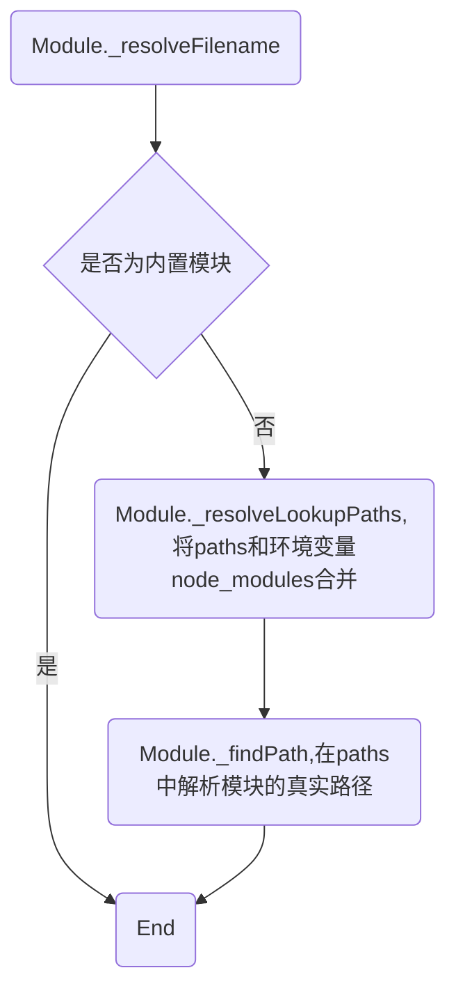
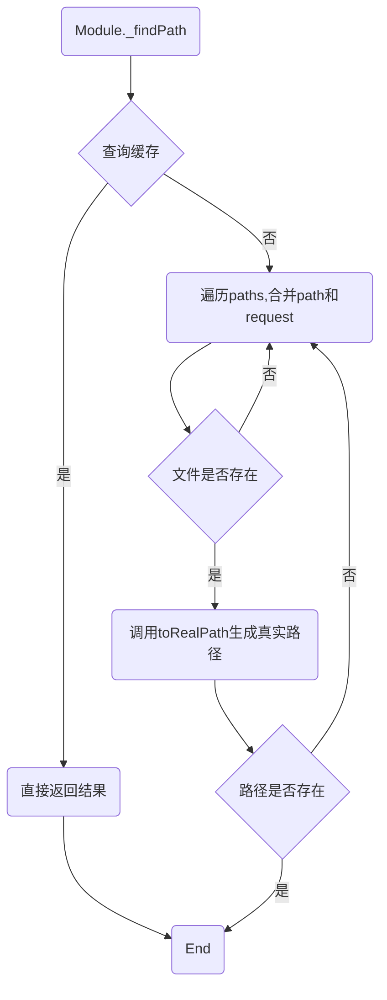

# module 模块使用

## \_resolveFilename

**作用：解析模块的真实路径，例如相对路径解析为绝对路径。**



```js
const parent = {
  id: fromFile, // 文件路径
  filename: fromFile, // 文件路径
  paths: Module._nodeModulePaths(fromDir), // 获取所有node_modules可能的位置
};

// 第二个参数实际上是父模块对象
Module._resolveFilename(moduleId, parent);
```

## \_nodeModulePaths

作用：生成 node_modules 可能的路径，例如

```js
Module._nodeModulePaths(fromDir);

// fromDir: /home/yuangong/tmp

// [ '/home/yuangong/tmp/node_modules',
// '/home/yuangong/node_modules',
// '/home/node_modules',
// '/node_modules' ]
```

## \_findPath



## Node 模块解析流程

- Nodejs 项目模块路径解析是通过`require.resolve`方法来实现的
- `require.resolve`就是通过`Module.resolveFileName` 方法实现的
- `require.resolve`实现原理:

  - `Module.resolveFileName`方法核心流程有 3 点:

    - 判断是否为内置模块
    - 通过`ModuleresolveLookupPaths`方法生成`node_modules`可能存在的路径
    - 通过`Module.findPath`查询模块的真实路径

  - `Module.findPath`核心流程有 4 点:

    - 查询缓存(将`request和paths`通过`\x00`合并成 cacheKey)
    - 遍历 paths 将`path与request`组成文件路径`basePath`
    - 如果`basePath`存在则调用`fs.realPathSync`获取文件真实路径
    - 将文件真实路径缓存到`Module.pathCache`(key 就是前面生成的 cacheKey)。

  - `fs.realPathSync`核心流程有 3 点:
    - 查询缓存(缓存的 key 为 p 即`Module.findPath`中生成的文件路径) 更多课程街
    - 从左往右遍历路径字符串，查询到`/`时，拆分路径，判断该路径是否为软链接，如果是软链接则查询真实链接，并生成新路径 p 然后继续往后遍历，这里有 1 个细节需要特别注意:
      - 遍历过程中生成的子路径 base 会缓存在 knownHard 和 cache 中，避免重复查询
    - 遍历完成得到模块对应的真实路径，此时会将原始路路径 original 作为 key，真实路径作为 value，保存到缓存中

- `require.resolve.paths`等价于`Module.resolveLookupPaths`，该方法用于获取所有`node_modules`
  - 如果路径为/(根目录)，直接返回`['/node_modules']`
  - 否则，将路径字符串从后往前遍历，查询到/时，拆分路径，在后面加上`node_modules`，并传入一个`paths`数组，直至查询不到`/`后返回`paths`数组
