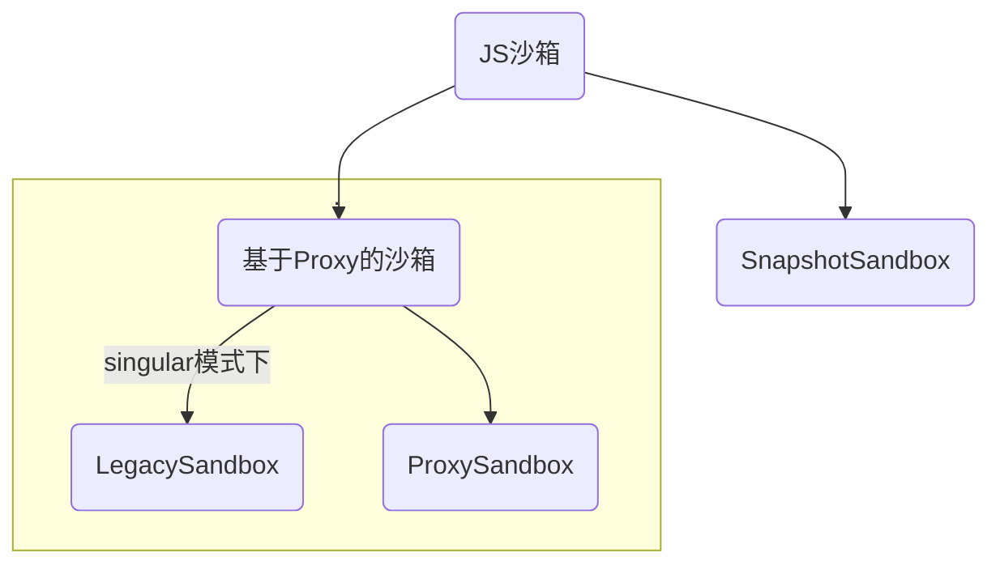
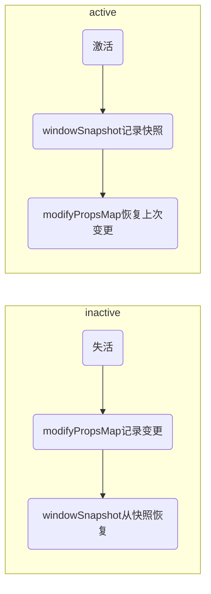

# JS 沙箱

在`qiankun`的实现中，包含了两种沙箱，分别为`基于Proxy实现的沙箱`和`快照沙箱`，当浏览器不支持`Proxy`会降级为`快照沙箱`



## Proxy 沙箱

```js
export default class ProxySandbox implements SandBox {
  /** window 值变更记录 */
  private updatedValueSet = new Set<PropertyKey>();
  name: string;
  type: SandBoxType;
  proxy: WindowProxy;
  sandboxRunning = true;
  latestSetProp: PropertyKey | null = null;

  active() {}

  inactive() {}

  constructor(name: string) {
    this.name = name;
    this.type = SandBoxType.Proxy;
    const { updatedValueSet } = this;

    const rawWindow = window;
    const { fakeWindow, propertiesWithGetter } = createFakeWindow(rawWindow);

    const descriptorTargetMap = new Map<PropertyKey, SymbolTarget>();
    const hasOwnProperty = (key: PropertyKey) => fakeWindow.hasOwnProperty(key) || rawWindow.hasOwnProperty(key);

    const proxy = new Proxy(fakeWindow, {
      set: (target: FakeWindow, p: PropertyKey, value: any): boolean => {},

      get(target: FakeWindow, p: PropertyKey): any {},

      // trap in operator
      // see https://github.com/styled-components/styled-components/blob/master/packages/styled-components/src/constants.js#L12
      has(target: FakeWindow, p: string | number | symbol): boolean {},

      getOwnPropertyDescriptor(target: FakeWindow, p: string | number | symbol): PropertyDescriptor | undefined {},

      // trap to support iterator with sandbox
      ownKeys(target: FakeWindow): PropertyKey[] {},

      defineProperty(target: Window, p: PropertyKey, attributes: PropertyDescriptor): boolean {},

      deleteProperty(target: FakeWindow, p: string | number | symbol): boolean {},
    });
    this.proxy = proxy;
    activeSandboxCount++;
  }
}
```

以上就是`Proxy沙箱的大致实现`，代码量不多，但是也有一些关键信息：

- `constructor`中会创建 window 对象的 Proxy
- `active`会激活沙箱, 一般在`mount`时会调用该方法
- `inactive`会使沙箱失活，一般在`unmount`阶段会调用该方法
- `get`和`set`，则会对值的设置和获取做一些处理，并且不会影响到原始的 window

### 1.初始化阶段

```js
constructor(name: string) {
  this.name = name;
  this.type = SandBoxType.Proxy;
  const { updatedValueSet } = this;

  const rawWindow = window;
  const { fakeWindow, propertiesWithGetter } = createFakeWindow(rawWindow);

  const descriptorTargetMap = new Map<PropertyKey, SymbolTarget>();
  const hasOwnProperty = (key: PropertyKey) => fakeWindow.hasOwnProperty(key) || rawWindow.hasOwnProperty(key);

  const proxy = new Proxy(fakeWindow, {...});
  this.proxy = proxy;
  activeSandboxCount++;
}
```

在初始化的阶段我们并不需要关心`proxy`是怎么实现的，我们只需要知道它做了这些事

1. 初始化一些`name`，`type`属性，这些并不重要，是 qiankun 内部使用
2. 创建伪造的 window 对象，createFakeWindow 做的事情比较简单，只是返回了`fakeWindow`和`propertiesWithGetter`

   - `fakeWindow` 伪造的 window 对象
   - `propertiesWithGetter` 判断属性是否有 getter，如果存在将不会使用`fakeWindow`上的属性值

   注意：如果原始对象的属性存在属性描述符，则会调用 Object.defineProperty 复用属性描述符

3. 基于`fakeWindow`创建 Proxy 对象

### 2.激活沙箱

设置当前沙箱处于运行中，并统计激活沙箱数量

```js
active() {
  if (!this.sandboxRunning) activeSandboxCount++;
  this.sandboxRunning = true;
}
```

### 3.触发 Setter

```js
set: (target: FakeWindow, p: PropertyKey, value: any): boolean => {
  // 沙箱处于运行中 才能赋值
  if (this.sandboxRunning) {
    // 如果fakeWindow上不存在这个属性  原window存在  代表该属性被delete了
    if (!target.hasOwnProperty(p) && rawWindow.hasOwnProperty(p)) {
      // 获取该属性的描述符
      const descriptor = Object.getOwnPropertyDescriptor(rawWindow, p);
      const { writable, configurable, enumerable } = descriptor!;
      // 如果该属性是可写的
      if (writable) {
        // 重新设置该属性的描述符
        Object.defineProperty(target, p, {
          configurable,
          enumerable,
          writable,
          value,
        });
      }
    } else {
      // 其他情况都需要直接赋值
      // @ts-ignore
      target[p] = value;
    }

    // 当属性在variableWhiteList中时 可以通过 fakeWindow 直接修改 原window
    if (variableWhiteList.indexOf(p) !== -1) {
      // @ts-ignore
      rawWindow[p] = value;
    }

    updatedValueSet.add(p);

    this.latestSetProp = p;

    return true;
  }

  if (process.env.NODE_ENV === 'development') {
    console.warn(`[qiankun] Set window.${p.toString()} while sandbox destroyed or inactive in ${name}!`);
  }

  // 在 strict-mode 下，Proxy 的 handler.set 返回 false 会抛出 TypeError，在沙箱卸载的情况下应该忽略错误
  return true;
},
```

`setter`做的事情比较简单，首先处于运行中的沙箱，它的`fakeWindow`才能被修改，其次有如下的步骤

1. 判断当前要设置的属性，如果`fakeWindow`不存在 而 原始的`window`存在该属性，代表已经被删除，需要重新设置属性描述符
2. 不满足以上条件，直接修改`fakeWindow`即可
3. 判断当前属性是否在白名单中，如果在则该属性的修改，将会直接影响到`rawWindow`

### 3.触发 Getter

```js
get(target: FakeWindow, p: PropertyKey): any {
  if (p === Symbol.unscopables) return unscopables;

  // avoid who using window.window or window.self to escape the sandbox environment to touch the really window
  // see https://github.com/eligrey/FileSaver.js/blob/master/src/FileSaver.js#L13
  // 当使用window.window or window.self 的时候不应该返回原window 而应该是 fakeWindow
  if (p === 'window' || p === 'self') {
    return proxy;
  }

  // hijack global accessing with globalThis keyword
  if (p === 'globalThis') {
    return proxy;
  }

  if (
    p === 'top' ||
    p === 'parent' ||
    (process.env.NODE_ENV === 'test' && (p === 'mockTop' || p === 'mockSafariTop'))
  ) {
    // if your master app in an iframe context, allow these props escape the sandbox
    // 正常情况下走该分支
    if (rawWindow === rawWindow.parent) {
      return proxy;
    }
    return (rawWindow as any)[p];
  }

  // proxy.hasOwnProperty would invoke getter firstly, then its value represented as rawWindow.hasOwnProperty
  if (p === 'hasOwnProperty') {
    return hasOwnProperty;
  }

  // 标记当前正在运行的沙箱
  if (p === 'document' || p === 'eval') {
    setCurrentRunningSandboxProxy(proxy);
    // FIXME if you have any other good ideas
    // remove the mark in next tick, thus we can identify whether it in micro app or not
    // this approach is just a workaround, it could not cover all complex cases, such as the micro app runs in the same task context with master in some case
    // 此时应用已经挂载，去除标记
    nextTick(() => setCurrentRunningSandboxProxy(null));
    switch (p) {
      case 'document':
        return document;
      case 'eval':
        // eslint-disable-next-line no-eval
        return eval;
      // no default
    }
  }

  // eslint-disable-next-line no-nested-ternary
  const value = propertiesWithGetter.has(p)
    ? (rawWindow as any)[p]
    : p in target
    ? (target as any)[p]
    : (rawWindow as any)[p];
  return getTargetValue(rawWindow, value);
}
```

1. 在触发`Getter`的过程中，我们会发现一些没有见过的`window`属性，例如`window.parent`, `window.top`, `window.self`，如果我们去控制台去打印会发现这样的情况


**这是为了防止，我们通过这样的方式去获取`rawWindow`，而直接修改它的值。**

2. 标记正在执行的沙箱，为什么访问`document`的时候才会进行标记呢？因为页面的渲染一定会伴随各种 dom 操作，所以在这个时候标记，是能够记录下正在执行的沙箱，
   当宏任务执行完毕，代表首次渲染完成时，又会把标记清除掉。
   **为什么标记？原因是为了让我们在首次渲染过程中，能够拿到当前的沙箱对象，获取其中的属性值**

3. 返回属性值

### 4. 失活沙箱

```js
inactive() {
  if (--activeSandboxCount === 0) {
    variableWhiteList.forEach((p) => {
      if (this.proxy.hasOwnProperty(p)) {
        // @ts-ignore
        delete window[p];
      }
    });
  }
  this.sandboxRunning = false;
}
```

该方法将会在`unmount`时调用，如果当前失活的沙箱是最后一个沙箱，它会删除掉白名单中`rawWindow`上的属性，并设置`sandboxRunning = false`

## Legacy 沙箱

```js
/**
 * 基于 Proxy 实现的沙箱
 * TODO: 为了兼容性 singular 模式下依旧使用该沙箱，等新沙箱稳定之后再切换
 */
export default class SingularProxySandbox implements SandBox {
  /** 沙箱期间新增的全局变量 */
  private addedPropsMapInSandbox = new Map<PropertyKey, any>();
  /** 沙箱期间更新的全局变量 */
  private modifiedPropsOriginalValueMapInSandbox = new Map<PropertyKey, any>();
  /** 持续记录更新的(新增和修改的)全局变量的 map，用于在任意时刻做 snapshot */
  private currentUpdatedPropsValueMap = new Map<PropertyKey, any>();
  name: string;
  proxy: WindowProxy;
  type: SandBoxType;
  sandboxRunning = true;
  latestSetProp: PropertyKey | null = null;
  active() {
    if (!this.sandboxRunning) {
      this.currentUpdatedPropsValueMap.forEach((v, p) => setWindowProp(p, v));
    }
    this.sandboxRunning = true;
  }
  inactive() {
    this.modifiedPropsOriginalValueMapInSandbox.forEach((v, p) => setWindowProp(p, v));
    this.addedPropsMapInSandbox.forEach((_, p) => setWindowProp(p, undefined, true));
    this.sandboxRunning = false;
  }
  constructor(name: string) {
    this.name = name;
    this.type = SandBoxType.LegacyProxy;
    const { addedPropsMapInSandbox, modifiedPropsOriginalValueMapInSandbox, currentUpdatedPropsValueMap } = this;
    const rawWindow = window;
    const fakeWindow = Object.create(null) as Window;
    const proxy = new Proxy(fakeWindow, {
      set: (_: Window, p: PropertyKey, value: any): boolean => {},
      get(_: Window, p: PropertyKey): any {},
      has(_: Window, p: string | number | symbol): boolean {},
      getOwnPropertyDescriptor(_: Window, p: PropertyKey): PropertyDescriptor | undefined {},
    });

    this.proxy = proxy;
  }
}
```

`LegacySandbox`只有在配置`sandbox.loose`才会起作用，该沙箱虽然也是基于 Proxy 实现的，但是它会直接修改或获取`rawWindow`的属性,其实现与快照沙箱比较相似，在激活和失活时，会对`window`进行恢复和还原。

### 1. 初始化阶段

```js
constructor(name: string) {
  this.name = name;
  this.type = SandBoxType.LegacyProxy;
  const { addedPropsMapInSandbox, modifiedPropsOriginalValueMapInSandbox, currentUpdatedPropsValueMap } = this;
  const rawWindow = window;
  const fakeWindow = Object.create(null) as Window;
  const proxy = new Proxy(fakeWindow, {
    set: (_: Window, p: PropertyKey, value: any): boolean => {},
    get(_: Window, p: PropertyKey): any {},
    has(_: Window, p: string | number | symbol): boolean {},
    getOwnPropertyDescriptor(_: Window, p: PropertyKey): PropertyDescriptor | undefined {},
  });

  this.proxy = proxy;
}
```

该阶段会初始化一些对象，并代理`fakeWindow`，需要注意的点

- addedPropsMapInSandbox：`inactive`时会使用，用于重置`window`，删除掉被添加的属性。
- modifiedPropsOriginalValueMapInSandbox：`inactive`时会使用，重置`window`, 恢复到一开始的状态
- currentUpdatedPropsValueMap: `active`时会使用，重新设置`window`，恢复到上次更新状态

### 2.激活沙箱

```js
active() {
  if (!this.sandboxRunning) {
    this.currentUpdatedPropsValueMap.forEach((v, p) => setWindowProp(p, v));
  }
  this.sandboxRunning = true;
}
```

通过`currentUpdatedPropsValueMap`重新设置`window`对象

### 3.触发 Setter

```js
set: (_: Window, p: PropertyKey, value: any): boolean => {
  if (this.sandboxRunning) {
    if (!rawWindow.hasOwnProperty(p)) {
      addedPropsMapInSandbox.set(p, value);
    } else if (!modifiedPropsOriginalValueMapInSandbox.has(p)) {
      // 如果当前 window 对象存在该属性，且 record map 中未记录过，则记录该属性初始值
      const originalValue = (rawWindow as any)[p];
      modifiedPropsOriginalValueMapInSandbox.set(p, originalValue);
    }

    currentUpdatedPropsValueMap.set(p, value);
    // 必须重新设置 window 对象保证下次 get 时能拿到已更新的数据
    // eslint-disable-next-line no-param-reassign
    (rawWindow as any)[p] = value;

    this.latestSetProp = p;

    return true;
  }

  if (process.env.NODE_ENV === 'development') {
    console.warn(`[qiankun] Set window.${p.toString()} while sandbox destroyed or inactive in ${name}!`);
  }

  // 在 strict-mode 下，Proxy 的 handler.set 返回 false 会抛出 TypeError，在沙箱卸载的情况下应该忽略错误
  return true;
}
```

当触发 Setter 时，会更新三个 Map

- 判断相对于`rawWindow`是否是新增属性，如果是则添加属性和值到`addedPropsMapInSandbox`
- `modifiedPropsOriginalValueMapInSandbox`如果没有记录过更新的`key`, 则记录该属性的初始值用于恢复。
- `currentUpdatedPropsValueMap` 记录当前更新的属性和值

### 4. 触发 Getter

```js
get(_: Window, p: PropertyKey): any {
  if (p === 'top' || p === 'parent' || p === 'window' || p === 'self') {
    return proxy;
  }

  const value = (rawWindow as any)[p];
  return getTargetValue(rawWindow, value);
},
```

和`Proxy沙箱`类似，也会处理`window.top`, `window.window`等情况

### 5.失活沙箱

```js
inactive() {
  this.modifiedPropsOriginalValueMapInSandbox.forEach((v, p) => setWindowProp(p, v));
  this.addedPropsMapInSandbox.forEach((_, p) => setWindowProp(p, undefined, true));

  this.sandboxRunning = false;
}
```

失活沙箱的实现就不多赘述了，懂得都懂~

## Snapshot 沙箱

```js
function iter(obj: typeof window, callbackFn: (prop: any) => void) {
  // eslint-disable-next-line guard-for-in, no-restricted-syntax
  for (const prop in obj) {
    if (obj.hasOwnProperty(prop)) {
      callbackFn(prop);
    }
  }
}

/**
 * 基于 diff 方式实现的沙箱，用于不支持 Proxy 的低版本浏览器
 */
export default class SnapshotSandbox implements SandBox {
  proxy: WindowProxy;

  name: string;

  type: SandBoxType;

  sandboxRunning = true;

  private windowSnapshot!: Window;

  private modifyPropsMap: Record<any, any> = {};

  constructor(name: string) {
    this.name = name;
    this.proxy = window;
    this.type = SandBoxType.Snapshot;
  }

  active() {
    // 记录当前快照
    this.windowSnapshot = {} as Window;
    iter(window, (prop) => {
      this.windowSnapshot[prop] = window[prop];
    });

    // 恢复之前的变更
    Object.keys(this.modifyPropsMap).forEach((p: any) => {
      window[p] = this.modifyPropsMap[p];
    });

    this.sandboxRunning = true;
  }

  inactive() {
    this.modifyPropsMap = {};

    iter(window, (prop) => {
      if (window[prop] !== this.windowSnapshot[prop]) {
        // 记录变更，恢复环境
        this.modifyPropsMap[prop] = window[prop];
        window[prop] = this.windowSnapshot[prop];
      }
    });

    if (process.env.NODE_ENV === 'development') {
      console.info(`[qiankun:sandbox] ${this.name} origin window restore...`, Object.keys(this.modifyPropsMap));
    }

    this.sandboxRunning = false;
  }
}
```

相比基于`Proxy`实现的沙箱，`SnapshotSandbox`实现非常简洁，只有`active`和`inactive`状态变化，可以用一个流程图来表示


