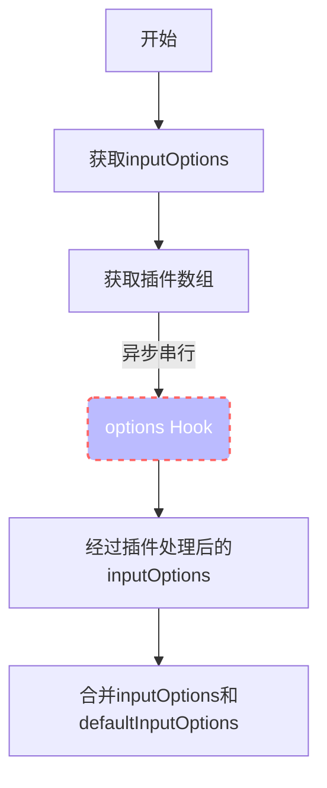
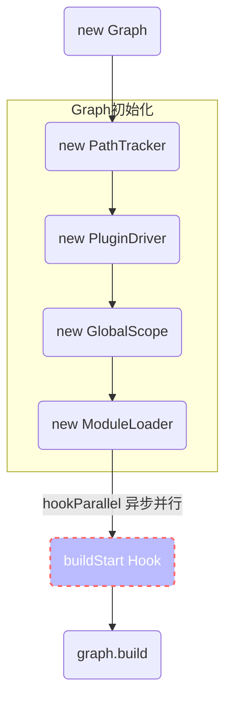
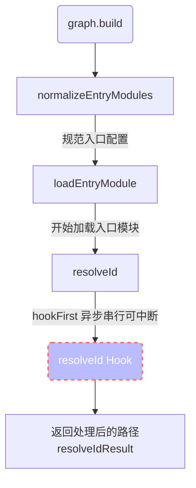
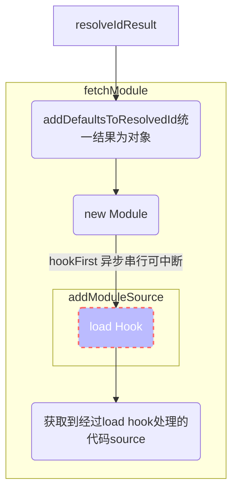
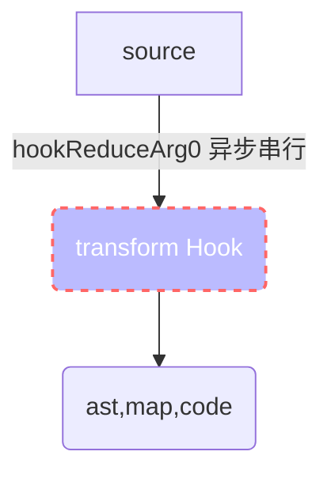
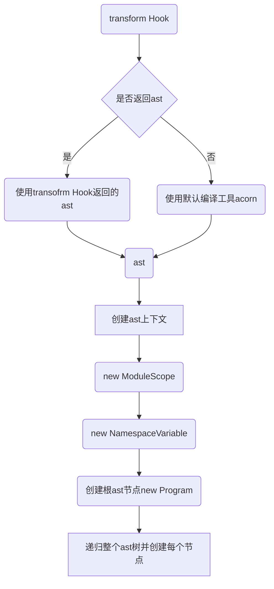
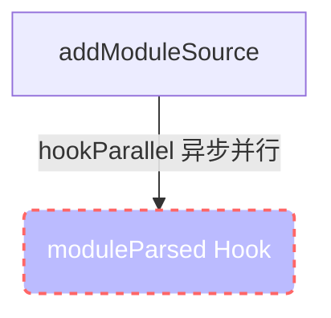
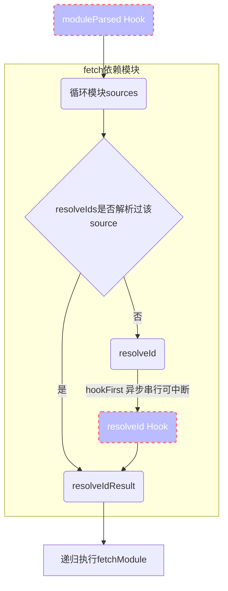
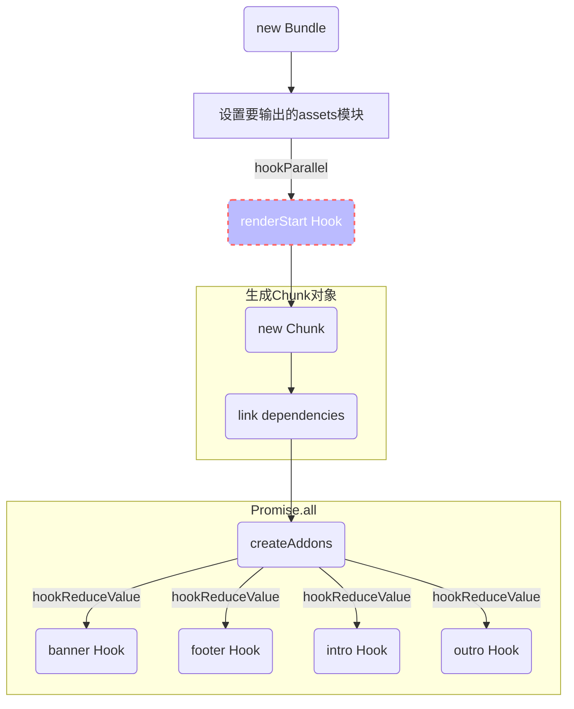

# rollup 源码之 plugin 编写指南

## 目录

[[toc]]

## 前言

rollup 作为一款轻量的打包编译工具，在我们日常的工具库开发中使用非常广泛，但是对于它的插件编写，从目前来看官网上对于插件的介绍几乎都是英文，学习起来也不是很友好, 例子也相对较少，所以整理一篇文章来学习也是不错的。除此之外，作为使用最广泛的 webpack，它的插件编写也比较简单和清晰的，那它和 rollup 中的插件使用又有什么区别呢。下面将借助流程图 并搭配一些 rollup 源码来讲解。

## 插件执行

我们知道`wepback`执行插件是借助了`tapable`用于同步串行、并行，异步串行并行等方式来执行插件，那 rollup 其实自己实现一套简易的类似`tapable`的功能。大家可以定位到源码中`src/utils/PluginDriver.ts`文件。

```js
class PluginDriver {
  hookFirst() {
    // ...
  }
  hookFirstSync() {
    // ...
  }
  hookParallel() {
    // ...
  }
  hookReduceArg0() {
    // ...
  }
  hookReduceArg0Sync() {
    // ...
  }
  hookReduceValue() {
    // ...
  }
  hookReduceValueSync() {
    // ...
  }
  hookSeqSync() {
    // ...
  }
}
```

下面分别介绍这些方法，都有什么作用，相信大家都通过方法名看出了具体作用了~

- **hookFirst**: 异步串行，出现第一个返回值不为空的插件，就停止执行,类似`tapable`的`AsyncSeriesBailHook`

- **hookFirstSync**: 同步串行，出现第一个返回值不为空的插件，就停止执行，类似`tapable`的`SyncBailHook`

- **hookParallel**： 异步并行 Promise.all，类似`tapable`的`AsyncParallelHook`

- **hookReduceArg0**: 异步串行，把上一个 hook 的返回值作为下一个 hook 的参数，如果返回为空就停止执行，并返回最后的值, 类似`tapable`的`AsyncSeriesWaterfallHook`

- **hookReduceArg0Sync**：同步串行，把上一个 hook 的返回值作为下一个 hook 的参数，如果返回为空就停止执行，并返回最后的值, 类似`tapable`的`SyncWaterfallHook`

- **hookReduceValue**: 异步串行，传入一个初始值 value，上一个 hook 处理好 value 后的返回值作为下一个 hook 的参数

- **hookReduceValueSync**: 同步串行，传入一个初始值 value，上一个 hook 处理好 value 后的返回值作为下一个 hook 的参数

- **hookSeq**: 异步串行，忽略返回值，类似`tapable`的`SyncHook`
- **hookSeqSync**: 同步串行，忽略返回值类似`tapable`的`AsyncSeriesHook`

通过上面的介绍，大家听过大概知道了 rollup 的插件是如何执行的。

## 示例

我们先从一段代码开始

```js
const rollup = require("rollup");
const path = require("path");
const inputOptions = {
  input: "./src/app.js",
};
const outputOptions = {
  file: "bundle.js",
  format: "cjs",
};

async function build() {
  // 第一步
  const bundle = await rollup.rollup(inputOptions);

  // 第二步
  const { code, map } = await bundle.generate(outputOptions);

  // 第三步
  await bundle.write(outputOptions);
}

build();
```

## 1. build 阶段

### options Hook



> 注意：options hook 会被异步串行执行

**插件示例**

参数：inputOptions

上下文：

- meta: { rollupVersion, watchMode }

```js
{
    name: 'options hook',
    options(inputOptions) {
        console.log(this.meta.rollupVersion) // 获取rollup版本信息
        console.log(this.meta.watchMode)     // 获取watchMode
        inputOptions.input = './src/index.js'; // 修改入口文件路径
        return inputOptions
    }
}

```

### buildStart Hook



可以看到在要执行`graph.build`之前，除了创建一些重要对象之外，还执行了`buildStart Hook`

```js
graph.pluginDriver.hookParallel("buildStart", [inputOptions]);
```

**插件示例**

参数：`inputOptions`

> 注意这里的 inputOptions 是经过合并处理过后的

```js
{
  name: 'buildStart',
  buildStart(inputOptions) {
    // 可通过引用类型 直接修改
    inputOptions.xx = xx
  }
}
```

### resolveId Hook

下面进入解析入口文件路径阶段



经过 rollup 内部的路径处理和`resolveId Hook`的处理，我们拿到了完整的入口文件路径。

```js
const pluginResult = await pluginDriver.hookFirst(
  "resolveId",
  [source, importer, { custom: customOptions }],
  null,
  skip
);
```

**插件示例**

参数：

- id 文件路径
- importer 可指定当前解析目录

```js
// 乞丐版的alias插件
// 第一种写法
{
  name: 'resolveId',
  resolveId(id) {
    const fullPath = id.replace('@', path.resolve(__dirname, 'src'));
    return id.includes('.js') ? fullPath : fullPath + '.js'
  }
}

// 第二种
{
  name: 'resolveId',
  resolveId(id) {
    const fullPath = id.replace('@', path.resolve(__dirname, 'src'));
    return {
      id: id.includes('.js') ? fullPath : fullPath + '.js',
      meta: xxx, // 模块meta信息
      moduleSideEffects: true, // 设置当前模块是否有副作用
      syntheticNamedExports: xxx // 默认为false,用法可参考 https://rollupjs.org/guide/en/#synthetic-named-exports
    }
  }
}
```

`resolveId Hook`也是比较常用的 hook，需要注意的是，如果有插件返回了值，那么后续所有插件的`resolveId`都不会被执行。

### load Hook



拿到上一个`resolveId hook`处理的路径后，就要进入读取入口文件的步骤了，这一步 rollup 给了我们很大权力，我们可以任意修改文件内容。但是要注意，每个文件只会被一个插件的`load Hook`处理，因为它是以`hookFirst`来执行的。另外，如果你没有返回值，rollup 会自动读取文件。

**插件示例**

参数：

- id 文件完整路径

```js
// 在所有文件前面添加注释
// 写法1
{
  name: 'load',
  load(id) {
    // 读取文件内容
    const content = fs.readFileSync(id);
    return '/*这是一段注释*/' + content.toString()
  }
}
// 写法2
{
  name: 'load',
  load(id) {
    // 读取文件内容
    const content = fs.readFileSync(id);

    // 也可以对代码进行转换 生成等操作
    transform(content)
    generate()
    return {
        code: '/*这是一段注释*/' + content.toString()
    }
  }
}
```

### transform Hook



关于这个 Hook 想必大家都猜到了，可以对代码进行转换。关于这块的代码示例简单介绍就可以了~，大家自行发挥~。

**插件示例**

参数

- code
- id

```js
// 写法1
{
  name: 'transform',
  transform(code, id) {
    return {
        code,
        map,
        ast
    }
  }
}
//写法2
{
  name: 'transform',
  transform(code, id) {
    return code
  }
}
```

接下来就进入`AST`的创建阶段了



上面的步骤其实递归了整个 ast 树，并为每个类型节点都创建了对应的`节点类`，对于它内部做了什么，本文不做讨论。


### moduleParsed Hook



在解析完模块后，我们能通过这个 hook 来获取模块的信息

```js
this.pluginDriver.hookParallel("moduleParsed", [module.info]);
```

**插件示例**

参数

- module.info 模块信息

```js
{
  id: string, // 模块路径
  code: string | null, // 模块代码
  ast: ESTree.Program, // 模块ast
  isEntry: boolean, // 是否是入口模块
  isExternal: boolean, // 是否是外部模块
  importedIds: string[], // 被此模块导入的所有模块id
  importers: string[], // 有哪些模块id 导入了该模块
  dynamicallyImportedIds: string[], // 通过import(xx)导入的所有模块id
  dynamicImporters: string[], // 有哪些模块通过import(xx)导入此模块
  implicitlyLoadedAfterOneOf: string[], // emitChunk会用到
  implicitlyLoadedBefore: string[],  // emitChunk会用到
  hasModuleSideEffects: boolean | "no-treeshake" // 模块是否有副作用
  meta: {[plugin: string]: any} // 模块元信息
  syntheticNamedExports: boolean | string // https://rollupjs.org/guide/en/#synthetic-named-exports
}
```

```js
{
  name: 'moduleParsed',
  moduleParsed(info) {
    console.log(info);
  }
}
```

获取到模块信息之后，`rollup`将会根据模块的依赖树递归，重复以上的步骤，过程如下



## 2.generate 阶段

> 时间原因，流程图后续补充

### renderStart、banner、footer、intro、outro Hook



**插件示例**

- **renderStart**

  参数：inputOptions, outputOptions

  ```js
  {
      name: 'renderStart',
      renderStart(inputOptions, outputOptions) {
        console.log(outputOptions);
        console.log(inputOptions);
      }
   }
  ```

- **banner、footer、intro、outro Hook**

```js
const outputOptions = {
  banner: "banner",
  footer: "footer",
  intro: () => "intro",
  outro: "outro",
};
```

在创建完 chunk 后，就会进入 chunk 的优化渲染阶段了，做的事情其实也比较简单，就是调用了所有 ast 节点的`render`方法，然后会把`included`为 false 的节点代码删除，也就是我们常说的`tree shaking`。

### renderDynamicImport

**插件示例**

参数：

```
{
    customResolution: string | null
    format: string, // cjs/es等
    moduleId: string,  // import的模块路径
    targetModuleId: string | null // 被import的模块路径
}
```

```js
// plugin
const plugin = {
  name: "dynamic-import-polyfill",
  renderDynamicImport() {
    return {
      left: "dynamicImportPolyfill(",
      right: ", import.meta.url)",
    };
  },
};

// input
import("./lib.js");

// output
dynamicImportPolyfill("./lib.js", import.meta.url);
```

### augmentChunkHash

**插件示例**

参数：chunkInfo

```js
{
  code: string,
  dynamicImports: string[],
  exports: string[],
  facadeModuleId: string | null,
  fileName: string,
  implicitlyLoadedBefore: string[],
  imports: string[],
  importedBindings: {[imported: string]: string[]},
  isDynamicEntry: boolean,
  isEntry: boolean,
  isImplicitEntry: boolean,
  map: SourceMap | null,
  modules: {  // chunk所包含的模块
    [id: string]: {
      renderedExports: string[],
      removedExports: string[],
      renderedLength: number,
      originalLength: number,
      code: string | null
    },
  },
  name: string,
  referencedFiles: string[],
  type: 'chunk',
}
```

```js
{
    name: 'augmentChunkHash',
    augmentChunkHash(chunkInfo) {
      if(chunkInfo.name === 'foo') {
        // 生成唯一值以更新chunkName
        return Date.now().toString();
      }
    }
}
```

### resolveImportMeta

参数：

- property `meta.xxx`
- 模块和 chunk id
  ```js
  {
    chunkId, moduleId, format;
  }
  ```

```js
// a.js
console.log(import.meta.testKey)

// rollup.config.js
{
    name: 'resolveImportMeta'
    resolveImportMeta(property, {moduleId}) {
      if (property === 'testKey') {
        return `new URL('${path.relative(process.cwd(), moduleId)}', document.baseURI).href`;
      }
      return null;
    }
}
```

### resolveFileUrl

**插件示例**

参数：

```js
{
  chunkId, fileName, format, moduleId, referenceId, relativePath;
}
```

```js
{
  name: 'resolveFileUrl',
  resolveFileUrl({fileName}) {
    return `new URL('${fileName}', document.baseURI).href`;
  }
}
```

### renderChunk

**插件示例**

参数：

```js
{
  code, // chunk代码
    chunk, // chunk的一些信息
    options; // outputOptions
}
```

```js
// 写法1
{
  name: 'renderChunk',
  renderChunk({ code }) {
    // change cdoe
    return {
        code,
        map
    }
  }
}

// 写法2
{
  name: 'renderChunk',
  renderChunk({ code }) {
    // change cdoe
    return '/*注释*/' + code
  }
}
```

### generateBundle

**插件示例**

参数：

- outputOptions
- ChunkInfo or AssetInfo

  ```js
  // AssetInfo
  moduleId: {
    fileName: string,
    name?: string,
    source: string | Uint8Array,
    type: 'asset',
  }

  // ChunkInfo
  moduleId: {
    code: string,
    dynamicImports: string[],
    exports: string[],
    facadeModuleId: string | null,
    fileName: string,
    implicitlyLoadedBefore: string[],
    imports: string[],
    importedBindings: {[imported: string]: string[]},
    isDynamicEntry: boolean,
    isEntry: boolean,
    isImplicitEntry: boolean,
    map: SourceMap | null,
    modules: {
      [id: string]: {
        renderedExports: string[],
        removedExports: string[],
        renderedLength: number,
        originalLength: number,
        code: string | null
      },
    },
    name: string,
    referencedFiles: string[],
    type: 'chunk',
  }
  ```

```js
{
  name: 'generateBundle',
  generateBundle(options, info) {
    delete info['app.js']  // 直接删除app.js chunk最后不会生成
  }
}
```

### writeBundle

与`generateBundle`相似， 但是此时 chunk 已经生成，无法修改

## 插件上下文

在 rollup 中每个插件都有自己的插件上下文，他具体又有什么用呢举个例子

```js
private runHookSync<H extends SyncPluginHooks>(
        const plugin = this.plugins[pluginIndex];
        const hook = plugin[hookName];
        if (!hook) return undefined as any;
        let context = this.pluginContexts[pluginIndex];
        if (hookContext) {
            context = hookContext(context, plugin);
        }
        try {
            if (typeof hook !== 'function') {
                return throwInvalidHookError(hookName, plugin.name);
            }
            // 关键看这里通过apply将插件的this指向了context
            return (hook as Function).apply(context, args);
        } catch (err) {
            return throwPluginError(err, plugin.name, { hook: hookName });
        }
}
```

至于`context`是什么，大家可以定位到`src/utils/PluginContext.ts`文件中

```js
const context: PluginContext = {
    addWatchFile(id) {},
    cache: cacheInstance,
    emitAsset: getDeprecatedContextHandler(...),
    emitChunk: getDeprecatedContextHandler(...),
    emitFile: fileEmitter.emitFile,
    error(err)
    getAssetFileName: getDeprecatedContextHandler(...),
    getChunkFileName: getDeprecatedContextHandler(),
    getFileName: fileEmitter.getFileName,
    getModuleIds: () => graph.modulesById.keys(),
    getModuleInfo: graph.getModuleInfo,
    getWatchFiles: () => Object.keys(graph.watchFiles),
    isExternal: getDeprecatedContextHandler(...),
    meta: {
        rollupVersion,
        watchMode: graph.watchMode
    },
    get moduleIds() {
        const moduleIds = graph.modulesById.keys();
        return wrappedModuleIds();
    },
    parse: graph.contextParse,
    resolve(source, importer, { custom, skipSelf } = BLANK) {
        return graph.moduleLoader.resolveId(source, importer, custom, skipSelf ? pidx : null);
    },
    resolveId: getDeprecatedContextHandler(...),
    setAssetSource: fileEmitter.setAssetSource,
    warn(warning) {}
};
```

也就是说我们可以在插件中直接通过`this.xxx`来调用上面的方法。他们都可以在各个 hook 中进行调用。下面进行介绍

### addWatchFile

用于动态添加对文件的监听，可以在`buildStart`、`load`、`resolveId`和`transform`中使用

```js
{
  name: 'addWatchFile',
  load() {
    // 监听a.js文件的变化
    this.addWatchFile('a.js')
  }
}
```

### emitFile

[文档地址](https://rollupjs.org/guide/en/#thisemitfileemittedfile-emittedchunk--emittedasset--string)

发射一个文件到最后的打包中，并且会返回一个`referenceId`,支持两种对象传参

```js
{
  type: 'chunk',
  id: string,
  name?: string,
  fileName?: string,
  implicitlyLoadedAfterOneOf?: string[],
  importer?: string,
  preserveSignature?: 'strict' | 'allow-extension' | 'exports-only' | false,
}

// EmittedAsset
{
  type: 'asset',
  name?: string,
  fileName?: string,
  source?: string | Uint8Array
}
```

### error

参数：

```js
{
  name: 'error',
  load() {
    // 抛出错误并显示 几行几列
    this.error(new Error('error message'), { column: 1, line: 1 })
  }
}
```

### getCombinedSourcemap

用于获取 sourceMap，并且只能在`transform hook`中使用

```js
{
  name: 'getCombinedSourcemap',
  transform() {
    // 获取sourceMap
    this.getCombinedSourcemap()
  }
}
```

### getFileName

获取通过`this.emitFile`文件发出的块或资源的文件名。文件名将相对于`outputOptions.dir`。

### getModuleIds

获取所有模块完整路径,需要注意的是，它返回的是个迭代器

```js
{
  name: 'getModuleIds',
  renderStart(outputOptions) {
    for (let id of this.getModuleIds()) {
        // get id
    }
  }
}
```

### getModuleInfo

获取模块 info, 例如可以搭配`getModuleIds`使用

```js
{
  name: 'getModuleInfo',
  renderStart(outputOptions) {
    for (let id of this.getModuleIds()) {
        const moduleInfo = this.getModuleInfo(id)
    }
  }
}
```

### getWatchFiles

获取所有被监听变化的文件路径 id, 包括通过`addWatchFile`添加的文件

```js
{
  name: 'getWatchFiles',
  renderStart(outputOptions) {
    const watchIds = this.getWatchFiles()
  }
}
```

### parse

用于编译代码，并返回 ast

```js
{
  name: 'parse',
  transform(code) {
      const ast = this.parse(code)
      // transform ast
  }
}
```

### resolve

用于解析传入参数的完整路径,以及其他参数，它会经过所有的`resolveId hook`处理

```js
{
  name: 'parse',
  buildStart(code) {
    this.resolve(
        id, // 要解析的文件路径
        importer, // 基于哪个目录解析
        {
            skipSelf: false, // 是否跳过resolveId Hook
            custom: {} // 用户自定义参数，会传给每个resolveId Hook
        }
    )
  }
}
```

### setAssetSource

设置 assets 资源的代码，例如我们通过`this.emitFile`发射一个文件，返回了 referanceId，可以通过这个 id 修改资源代码

```js
this.setAssetSource(referenceId: string, source: string | Uint8Array) => void
```
