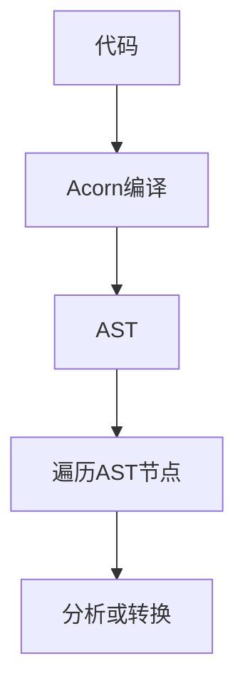

# tree-shaking 原理

## 什么是 tree shaking

可以简单理解为，Dead Code Elimination，即死代码去除，在保持代码最终运行结果不变的情况下，去除无用代码

1. 有效减小程序体积
2. 减少运行时间

## 前言

在前端常见的打包工具中，几乎都默认集成了 tree shaking，而作为第一个使用 tree shaking 技术的打包工具 rollup，它的源码是非常有学习价值的。在学习 tree shaking 的过程中会涉及到一些概念，包括：

1. `SideEffect（副作用）`
2. `AST抽象语法树`

## SideEffect（副作用）

什么是 SideEffect（副作用），与 tree-shaking 又有什么关系？其实简单来讲，tree shaking 依赖了 SideEffect 的概念来对代码进行优化，SideEffect 也并不是一种代码，而只是一种概念，下面举个例子

```javascript
// index.js
import "./a.js";
import { a } from "./b.js";
console.log(a);

// a.js
let a = 1; // 删除
let b = 2; // 保留
console.log(b); // 保留

window.c = 3; // 保留
d = 4; // 保留

// b.js
export const a = 1; // 保留
export const b = 2; // 导出但未使用，删除
```

以上便是 tree-shaking 所做的事情。
总结一下什么情况下才代表是 SideEffect

- `global`, `document`, `window`, 全局变量修改，如`window.xxx = xx`
- `console.log`，`history.pushState`等方法调用
- 未声明的变量，如`a = 1`

### 用法

webpack 中想使用 sideEffects，版本号需要 >= 4, 并在 package.json 中配置

#### webpack sideEffects 配置

```json

// package.json
// 指定整个项目都没有副作用
{
    "sideEffects": false
}
// 指定文件没有副作用
{
  "sideEffects": [
    "dist/*",
    "es/**/style/*",
    "lib/**/style/*"
  ]
}
```

```javascript
module.exports = {
  module: {
    rules: [
      {
        test: /\.jsx?$/,
        exclude: /(node_modules|bower_components)/,
        use: {
          loader: "babel-loader",
        },
        sideEffects: false,
      },
    ],
  },
};
```

#### rollup 中 sideEffects 配置

1. /_@**PURE**_/注释忽略副作用

```javascript
// inputOptions
treeshake: {
  annotations: true;
}
```

```javascript
  /*@__PURE__*/console.log('side-effect');

  class Impure {
    constructor() {
      console.log('side-effect')
    }
  }

  /*@__PURE__*/new Impure();

  //打包后为空
  ...
```

2. 设置模块的副作用
   如果 import 的模块没有用到，当`moduleSideEffects`为`true`, 则默认为都是有副作用的，那么会保留模块内的副作用代码，如果`moduleSideEffects`为`false`，则默认为都没有副作用，模块 import 将直接被去除。

```javascript
// inputOptions
treeshake: {
  moduleSideEffects: true; // or false
}
```

```javascript
// input file
import { unused } from "external-a";
import "external-b";
console.log(42);

// treeshake.moduleSideEffects === true
import "external-a";
import "external-b";
console.log(42);

// treeshake.moduleSideEffects === false
console.log(42);
```

3. 设置对象属性访问的副作用

```javascript
// inputOptions
treeshake: {
  propertyReadSideEffects: true; // or false
}
```

```javascript
const foo = {
  get bar() {
    console.log("effect");
    return "bar";
  },
};
// propertyReadSideEffects === true 不会被去除
// propertyReadSideEffects === false 默认为无副作用，会被去除
const result = foo.bar;

const illegalAccess = foo.quux.tooDeep;
```

4、设置未声明变量的副作用

```javascript
// inputOptions
treeshake: {
  unknownGlobalSideEffects: true; // or false
}
```

```javascript
// input
const jQuery = $;
const requestTimeout = setTimeout;
const element = angular.element;

// unknownGlobalSideEffects == true
const jQuery = $;
const element = angular.element;

// unknownGlobalSideEffects == false
const element = angular.element;
```

以上便是副作用的相关介绍，下面介绍另一个概念。

## AST 抽象语法树

目前前端方面能将 JS 编译成 AST 的工具有很多，如`babylon`、`@babel/parser`、`acorn`等。但其实在 babel、webpack 和 rollup 源码中其实都使用了`acorn`作为它们代码编译的工具。支持插件，可以通过插件扩展语法支持。正是速度快加上支持插件让很多工具都使用 acorn。

> babel parser(babylon) 也是基于 acorn，并且对 AST 节点和属性都做了扩展，也提供了一些支持 typescript、jsx、flow 的插件（就是我们可以在 @babel/parser 的 plugins 里面指定的那些）。

大概看下 JS 代码经过`acorn`编译后 ast 的样子


我们可以看到有不少的节点类型，例如

- `VariableDeclaration`
- `FunctionDeclaration`
- `Identifier`
- ...

## 开始

首先我们需要知道的是，rollup 它到底如何操作经过`acorn`的语法树呢。其实跟大家想的一样，这个过程一定是这样的。



那么在 rollup 内部其实为每个 AST 节点都编写了对应的节点类，如图


其中也包含了节点的基类`NodeBase`

```js
export class NodeBase implements ExpressionNode {
	context: AstContext;
	end!: number;
	esTreeNode: acorn.Node;
	included = false; // tree shaking  是否打包到输出文件
	keys: string[];
	parent: Node | { context: AstContext; type: string };
	scope!: ChildScope;
	start!: number;
	type!: keyof typeof NodeType;


        constructor() {
            // ...
        }

        hasEffects(){
            // ...
        }
        include(){
            // ...
        }

        // ...方法
}
```

大多数子类都实现了`hasEffects`,`include`方法，否则使用`NodeBase`基类中的方法。
并且每个子类中都有`included`属性。它们的含义如下。

- `属性 included`: 是否打包到输出文件，如果为 false,就被 tree shaking 掉
- `方法 hasEffects`: 判断节点是否有副作用
- `方法 include`: 结合 hasEffects，设置`included = true`
- `方法 shouldBeIncluded`: 如果没有被 includeed,内部会继续调用`hasEffects`

### hasEffects

用于判断该节点是否存在副作用

```js
export class Identifier extends NodeBase implements PatternNode {
   // ... 属性
   	hasEffects(): boolean {
		return (
                        //
			(this.context.options.treeshake as
                        NormalizedTreeshakingOptions).unknownGlobalSideEffects &&
                        // 是否是全局变量, 如果出现未声明变量会被提升到全局
			this.variable instanceof GlobalVariable &&
			// 判断可以被访问到的变量是否有副作用
			this.variable.hasEffectsWhenAccessedAtPath(EMPTY_PATH)
		);
	}
}
```

为什么要介绍`Identifier`节点的`hasEffects`呢，原因很简单，因为不管是全局变量，全局方法，在遍历的最后其实都会走到`Identifier`节点。这个方法做的事情很简单

- `unknownGlobalSideEffects`为 true, 关于该参数用法前面有讲过，就不多赘述。
- `this.variable instanceof GlobalVariable`为 true，判断是否是全局变量，例如`未声明的变量`，`window`，`this(严格模式有不同表现)`。
- `this.variable.hasEffectsWhenAccessedAtPath(EMPTY_PATH)`为 true，表示可以访问到的全局变量，例如`window`, `console`
  讲完这些其实已经不需要再看内部实现了，大家只需要记住如何判断是否有副作用即可。

### include

这里先暂时略过，后面会分析到

### shouldBeIncluded

如果没有被`includeed`,内部会继续调用`hasEffects`

## 示例

通过上面简单的了解，我们就可以开始 rollup 源码的分析了，本篇不会大幅度粘贴代码，这样反而容易造成困惑，我会尽量用图来方便理解。我们先从一段代码开始。

```javascript
// index.js
import { f } from "./b.js";
console.log(f);
```

```js
"use strict";
c = 1;
window.d = 1;

const obj = {
  // tree shaking
  a: 2,
};

function func() {
  c = 2;
  function innerFunc() {
    // tree shaking
    console.log(3);
  }
}

func();

export const e = 1; // tree shaking

export const f = 1;
```

## 分析

rollup 在生成所有`Module`后会调用所有模块的`include`方法，关于模块生成部分本文不会进行讲解，我们只需要知道，调用 Module 类的`include`方法之后就可以为每个 AST 节点设置`included`的值，如果节点为`true`该节点代码最终会被保留。

> 注意：**所有节点的 included 默认为 false**，默认都不会被打包生成, 只有主动执行 include 才会被保留。

代码解释如下：

- `Module` include
  - `AST` shouldBeIncluded: 判断整个模块是否包含副作用
  - `AST` include：设置 AST`included`值

```js
class Module {
    // ...

    include(): void {
            const context = createInclusionContext();
            if (this.ast!.shouldBeIncluded(context)) this.ast!.include(context, false);
    }

    // ...
}
```

`shouldBeIncluded`执行后，会从`Program`开始递归每个`AST`节点，只要有一行代码出现了副作用，直接 return,中断掉后续`hasEffects`递归，也是一种简单的优化。然后执行`include`方法。

```js
class Program extends NodeBase {
	body!: StatementNode[];
	hasEffects(context: HasEffectsContext) {
		// 如果之前已经判断出现过副作用，直接返回true
		if (this.hasCachedEffect) return true;
		for (const node of this.body) {
			if (node.hasEffects(context)) {
                              // 缓存副作用判断结果
				return (this.hasCachedEffect = true);
			}
		}
		return false;
	}

        // 出现副作用后会执行该方法
        include(context: InclusionContext, includeChildrenRecursively: IncludeChildren) {
            this.included = true;
            for (const node of this.body) {
                    if (includeChildrenRecursively || node.shouldBeIncluded(context)) {
                            node.include(context, includeChildrenRecursively);
                    }
            }
	}
}
```

下面开始分析

### 1. 未声明的变量

```js
"use strict";
c = 1;
```

AST 如下


可以看到以上代码的节点类型都是`ExpressionStatement`, 那么很容易定位到在 rollup 源码中的位置
`src\ast\nodes\ExpressionStatement.ts`, 其他代码暂且不看，我们主要关注的是他如何处理副作用的

```js
export default class ExpressionStatement extends StatementBase {
	directive?: string;
	expression!: ExpressionNode;

	shouldBeIncluded(context: InclusionContext) {
            // 判断如果不是"use strict"表达式
            if (this.directive && this.directive !== 'use strict')
                // 优化掉无用表达式
                    return this.parent.type !== NodeType.Program;
            // 正常的表达式继续递归
            return super.shouldBeIncluded(context);
	}
}
```

继续调用`shouldBeIncluded`,会走到`AssignmentExpression`下的`hasEffects`
，发现最后其实调用的还是`Identifier`的`hasEffects`,整个流程如下


```js
class AssignmentExpression extends NodeBase {
  hasEffects(context: HasEffectsContext): boolean {
    if (!this.deoptimized) this.applyDeoptimizations();
    return (
      // 判断右表达式是否有副作用
      this.right.hasEffects(context) ||
      // 判断左表达式是否有副作用
      this.left.hasEffects(context) ||
      // 判断对变量赋值是否有副作用，例如对全局变量的赋值。
      this.left.hasEffectsWhenAssignedAtPath(EMPTY_PATH, context)
    );
  }
}
```

最后不断的递归`hasEffects`，`ExpressionStatement`节点的`shouldBeIncluded`返回`true`,随后递归调用`include`方法，将每个子节点的`included`设置为`true`。
需要注意的是`GlobalVariable`的`hasEffectsWhenAssignedAtPath`,会永远返回 true,所以对全局变量赋值的语句必定是有副作用的。
（推荐对着源码看，不然这里会看不懂）

### 2. 全局变量

```js
window.d = 1;
```

区别与第一个不大，唯一的不同应该是在`isGlobalMember`返回值的判断上。

```js
function isGlobalMember(path: ObjectPath): boolean {
  if (path.length === 1) {
    // 如果是undefine或者是全局对象，例如window, 注意path.length === 1
    return path[0] === "undefined" || getGlobalAtPath(path) !== null;
  }
  return getGlobalAtPath(path.slice(0, -1)) !== null;
}
```

如果是`window`,`document`等对象，都会返回`true`,也就是说`全局变量`的 hasEffects 方法返回的都是 false。那么它是怎么被保留下来的呢，其实在前面我们说过了一个方法，叫`hasEffectsWhenAssignedAtPath`,由于`GlobalVariable`类并没有这个方法，所以会向父类查找，可以看到父类`Variable`,在该方法上永远返回`true`

```js
class Variable implements ExpressionEntity {
  hasEffectsWhenAssignedAtPath(_path: ObjectPath, _context: HasEffectsContext) {
    return true;
  }
}
```

### 3. 未使用的变量

```
const obj = { // tree shaking
  a: 2
}
```

AST 如下


由于`VariableDeclaration`类并没有`hasEffects`方法，则会使用父类中的`hasEffects`

```js
class NodeBase implements ExpressionNode {
    shouldBeIncluded(context: InclusionContext): boolean {
            return this.included || (!context.brokenFlow && this.hasEffects(createHasEffectsContext()));
    }
    hasEffects(context: HasEffectsContext): boolean {
            for (const key of this.keys) {
                    const value = (this as GenericEsTreeNode)[key];
                    if (value === null || key === 'annotations') continue;
                    if (Array.isArray(value)) {
                            for (const child of value) {
                                    if (child !== null && child.hasEffects(context)) return true;
                            }
                    } else if (value.hasEffects(context)) return true;
            }
            return false;
    }
}
```

那么最后其实还是这个过程


虽然对它进行了递归，但是我们可以发现它并没有使用到任何全局变量，所以`include`方法不会被执行，`included`也都为`false`

## 参考文献

- [深入浅出 sideEffects](https://zhuanlan.zhihu.com/p/41795312)
- [rollup 官方文档](https://rollupjs.org/guide/en/#treeshake)
