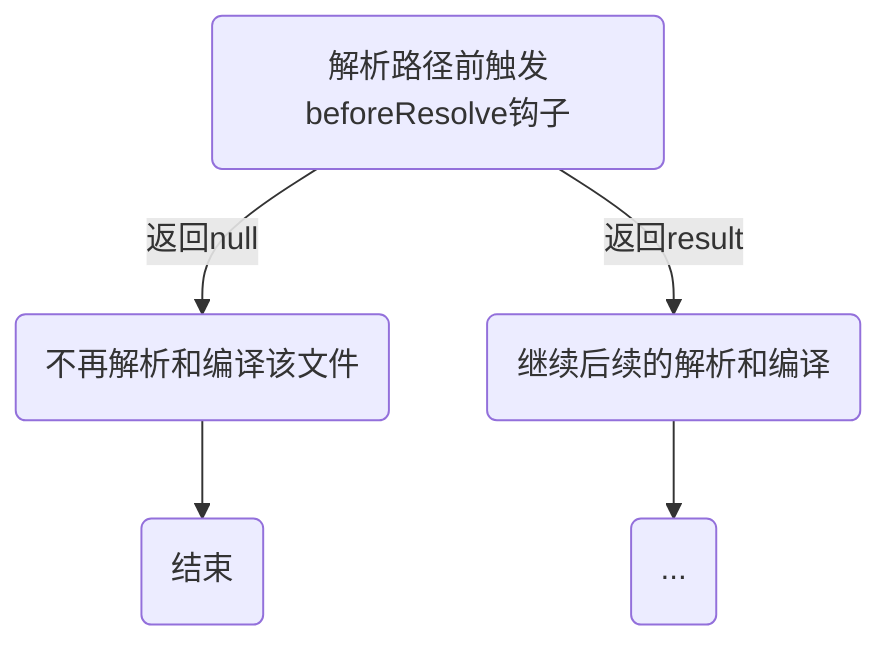

# webpackIgnore 优化 moment

当你在代码中写`import moment from 'moment'`，通过打包分析会发现`moment`所占用的大小比想象中大不少，而我们只是用了其中的日期解析功能。
其实它的大部分体积都在`语言包`上，我们只需要排除掉这一部分，就能减少最终的包体积。常用的方案如下

**该插件支持的写法如下**

```js
// 1.
new webpack.IgnorePlugin(/^\.\/locale$/, /moment$/);

// 2.
new webpack.IgnorePlugin({
  resourceRegExp: /^\.\/locale$/,
  contextRegExp: /moment$/,
});

// 3.
new webpack.IgnorePlugin({
  checkResource: (request, context) => {
    // 作用同resourceRegExp
    return /^\.\/locale$/.test(request);
  },
  checkContext: (context) => {
    // 作用同contextRegExp
    return /moment$/.test(context);
  },
});
```

## 实现原理

首先我们需要了解一下`webpack`在此处对文件解析的过程



### 1. 触发 hook

`NormalModuleFactory`中注册了很多模块解析相关的`hook`,其中`beforeResolve`是`AsyncSeriesWaterfallHook`, 也就是说它是`可中断异步串行钩子`

```js
beforeResolve: new AsyncSeriesWaterfallHook(["data"]),
```

接收参数如下,后面的源码中会用到

```js
{
  contextInfo: {
    compiler: undefined
    issuer: '文件完整路径'
  },
  resolveOptions,
  context,  // 文件所在项目根目录
  request, // 代码里写的路径，比如import xx from './xxx',这里的值就是./xxx
  dependencies // 模块的依赖
}
```

[webpack-hook 执行流程](../../webpack/webpack-hook执行流程.html#normalmodulefactory-beforeresolve-callasync)

### 2. 实现

```js
class IgnorePlugin {
  constructor(options) {
    if (arguments.length > 1 || options instanceof RegExp) {
      options = {
        resourceRegExp: arguments[0], // 具体的目录和文件
        contextRegExp: arguments[1], // 需要忽略的模块
      };
    }
    validateOptions(schema, options, "IgnorePlugin");
    this.options = options;
    this.checkIgnore = this.checkIgnore.bind(this);
  }

  checkIgnore(result) {
    if (!result) return result;
    // IgnorePlugin插件支持传入checkResource和checkContext方法，会先后调用，如果匹配会返回null
    if (
      "checkResource" in this.options &&
      this.options.checkResource &&
      this.options.checkResource(result.request, result.context)
    ) {
      if ("checkContext" in this.options && this.options.checkContext) {
        if (this.options.checkContext(result.context)) {
          return null;
        }
      } else {
        return null;
      }
    }

    // resourceRegExp和contextRegExp会先后进行匹配，如果匹配会返回null
    if (
      "resourceRegExp" in this.options &&
      this.options.resourceRegExp &&
      this.options.resourceRegExp.test(result.request)
    ) {
      if ("contextRegExp" in this.options && this.options.contextRegExp) {
        if (this.options.contextRegExp.test(result.context)) {
          return null;
        }
      } else {
        return null;
      }
    }

    return result;
  }

  apply(compiler) {
    // 触发normalModuleFactory钩子时注册beforeResolve
    compiler.hooks.normalModuleFactory.tap("IgnorePlugin", (nmf) => {
      // 解析前调用
      nmf.hooks.beforeResolve.tap("IgnorePlugin", this.checkIgnore);
    });
    compiler.hooks.contextModuleFactory.tap("IgnorePlugin", (cmf) => {
      cmf.hooks.beforeResolve.tap("IgnorePlugin", this.checkIgnore);
    });
  }
}
```

**过程如下**

1. 判断是否存在`checkResource`和`checkContext`,有就调用，并根据返回值判断。
   **如果两者都存在，同时都返回 true,则忽略该文件；如果 checkResource 存在，返回 true，则忽略该文件**

2. 判断是否存在`resourceRegExp`和`contextRegExp`, 根据正则匹配来判断。
   **如果两者都存在，经过正则匹配都为 true,则忽略该文件；如果 resourceRegExp 存在，匹配结果为 true，则忽略该文件**
